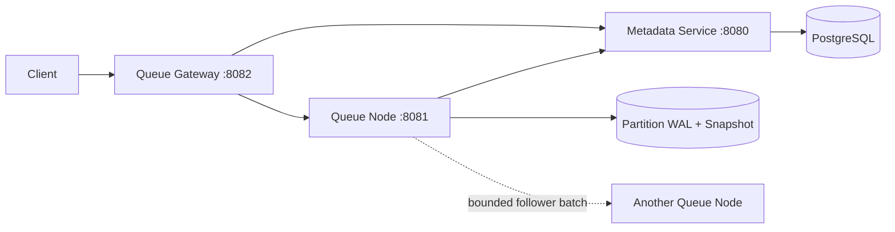

# Distributed Queue in Java

A Java 21 queue built incrementally to study the correctness mechanisms behind
durable distributed systems: state machines, leases, write-ahead logging,
snapshots, fencing, routing, replication, and failure recovery.

This is a learning and architecture project, not a production-ready message
broker or an attempt to copy every feature of an existing queue.

## Project status

**Latest release:** v0.27.0 — bounded follower transport and one-cycle catch-up.

**Current development:** v0.28.0 implementation — durable logical replicated
log.

The [v0.28 HLD](docs/design/v0.28-durable-log-hld.md),
[LLD](docs/design/v0.28-durable-log-lld.md), and
[ADR 0027](docs/adr/0027-durable-logical-replicated-log.md) define the logical
index, term, hard-state, snapshot, recovery, and one-force batch boundaries.
The implementation is based on the checked-in
[v0.27.1 performance baseline](docs/benchmarks/v0.27.1/README.md).

## What works today

- FIFO publication within one local partition;
- receipt-handle ACK and NACK;
- finite delivery leases, redelivery, retry limits, delayed retry, and DLQ;
- retained-message and retained-byte admission limits;
- WAL-first durable state transitions with CRC32C-protected frames;
- persisted leases and restart recovery;
- snapshots plus retained WAL suffix recovery;
- segmented WAL rotation and snapshot-authorized reclamation;
- durable queue/generation/partition lineage validation;
- PostgreSQL-backed tenant queue metadata;
- lease-fenced provisioning and runtime activation;
- stable customer routing through the queue gateway;
- epoch-fenced, ordered follower WAL storage;
- bounded follower HTTP batches and resumable one-cycle catch-up;
- durable logical index and term in segmented-WAL frames;
- one-force follower durability groups and replica hard state;
- snapshot logical boundaries that survive reclaimed WAL prefixes.

## What is not guaranteed yet

- no automatic replica placement or replication scheduler;
- no majority-quorum acknowledgement;
- no node-coordinated leader election;
- no automatic follower promotion or divergent-log repair;
- no snapshot transfer between nodes;
- no multi-partition customer queue;
- internal service endpoints are not authenticated;
- no claim of production availability, security, or operational maturity.

A follower copy is durable local storage, but it is not yet a committed replica.

## Architecture



| Module | Responsibility |
|---|---|
| `queue-core` | Local queue state machine, WAL, snapshots, compaction, and follower storage |
| `metadata-service` | Tenant queue identity, node registry, placement, and fenced lifecycle authority |
| `queue-node` | Partition reconciliation, local storage runtime, internal data plane, and follower transport |
| `queue-gateway` | Stable customer endpoint and READY-authority routing |
| `queue-benchmarks` | JMH performance experiments and checked-in evidence |

The metadata service and gateway use ports-and-adapters boundaries. PostgreSQL
is control-plane authority; it is not in the message commit path and will not
become a substitute for node-coordinated consensus.

## Quick start

Prerequisites: Java 21, Maven, Docker, and Docker Compose v2.

```bash
docker compose up --detach --build
docker compose ps
```

Open:

- metadata API: [http://localhost:8080/swagger-ui.html](http://localhost:8080/swagger-ui.html)
- queue-node API: [http://localhost:8081/swagger-ui.html](http://localhost:8081/swagger-ui.html)
- gateway API: [http://localhost:8082/swagger-ui.html](http://localhost:8082/swagger-ui.html)

Run the full test suite:

```bash
mvn clean test
```

Detailed startup, API examples, configuration, reset procedures, and
troubleshooting are in the
[local development runbook](docs/runbooks/local-development.md).

## Current milestone

v0.28 addresses the correctness gap where follower sequence depended on
counting retained WAL records and therefore failed after snapshot-authorized
prefix reclamation.

The implementation:

- stores `logIndex`, `logTerm`, and `WalRecord` in every replicated WAL frame;
- retains `WalPosition` as the separate physical recovery boundary;
- binds snapshots to logical index/term and physical position;
- persists replica term, vote, and commit hard state;
- writes a validated bounded batch followed by one `force(true)`;
- recovers a complete prefix and poisons the writer after ambiguous I/O failure.

It deliberately does not add quorum commit, election, membership, or promotion.

## Roadmap

```text
v0.28  durable logical replicated log
  ↓
v0.29  replica membership and placement
  ↓
v0.30  automatic catch-up and learner bootstrap
  ↓
v0.31  majority commit and committed-only apply
  ↓
v0.32  node-coordinated leader election
  ↓
v0.33  safe promotion and replica repair
  ↓
later  multi-partition queue semantics
```

Every milestone follows:

```text
semantics → invariants → failure scenarios → tests → implementation
          → regression → documentation → benchmark when required
```

The detailed phases and issue-ready backlog are in the
[delivery plan](docs/distributed-queue-delivery-plan.md).

## Documentation

| Document | Purpose |
|---|---|
| [Semantics](docs/semantics.md) | Guarantees and explicit non-guarantees |
| [Failure scenarios](docs/failure-scenarios.md) | Expected behavior at failure boundaries |
| [Trade-offs](docs/trade-offs.md) | Benefits, costs, and deferred choices |
| [Architecture handbook](docs/architecture/README.md) | Partition, replication, durability, metadata, and guarantee models |
| [Storage architecture](docs/design/storage-architecture.md) | Current storage internals and phased distributed evolution |
| [Target architecture](docs/distributed-queue-target-architecture.md) | Long-term distributed design |
| [Delivery plan](docs/distributed-queue-delivery-plan.md) | Milestones and implementation order |
| [ADRs](docs/adr) | Accepted and proposed architectural decisions |
| [Diagrams](docs/diagrams/README.md) | Runtime and protocol flows |
| [Engineering guidelines](docs/engineering-guidelines.md) | Code, naming, testing, and logging conventions |
| [Local runbook](docs/runbooks/local-development.md) | Build, run, test, reset, and troubleshooting |

## Design principles

- Define guarantees before implementation.
- Derive mechanisms from concrete failure scenarios.
- Keep control-plane observation separate from data-plane durability authority.
- Fail closed when durable artifacts disagree.
- Benchmark before optimizing a durability boundary.
- Add complexity only when a real limitation requires it.
