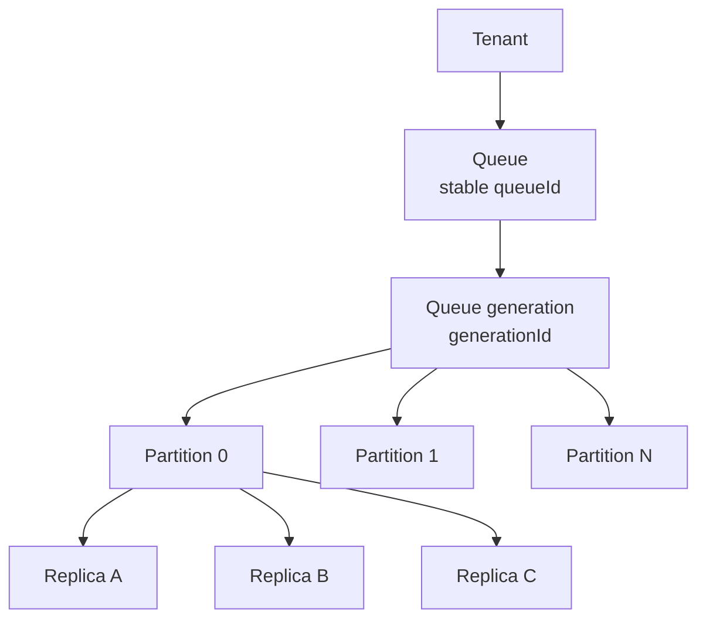
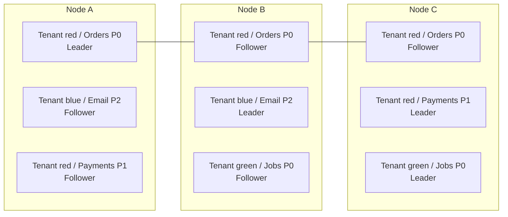
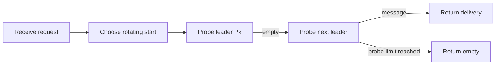
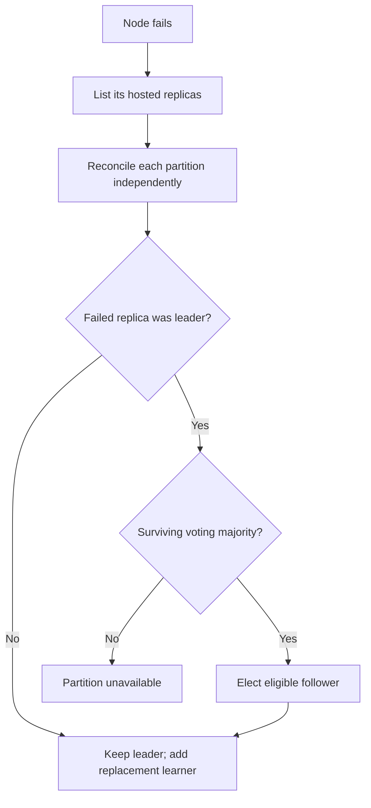

# Appendix A — Partition Model

## Status

**Target design.** The current system still creates partition zero only.

## Identity hierarchy



| Identity | Lifetime | Purpose |
|---|---:|---|
| `tenantId` | Customer lifetime | Namespace and authorization boundary |
| `queueId` | Queue lifetime | Stable customer-visible queue identity |
| `generationId` | One create/delete incarnation | Prevents stale storage from an old queue incarnation being reused |
| `partitionId` | Queue-generation lifetime | Ordering, replication, snapshot, and failover boundary |
| `replicaId` | Membership lifetime | Identifies one member of a partition replica group |
| `nodeId` | Node configuration lifetime | Physical host; never part of logical message identity |
| `registrationEpoch` | Node-process lifetime | Fences an obsolete process using the same node ID |
| `logTerm` | Election term | Identifies the leader authority that created a log entry |
| `logIndex` | Partition-generation lifetime | Defines one logical position in the partition log |

Durable lineage is:

```text
(queueId, generationId, partitionId)
```

`nodeId` and `replicaId` locate copies of the lineage; they do not redefine it.

## One node, many customers



Each hosted replica owns independent WAL, snapshot, hard state, apply progress,
admission gate, and lifecycle. One damaged partition must not poison unrelated
partitions on that node.

## Partition selection

### Keyed publish

```text
partition = stableHash(messageGroupId) mod partitionCount
```

The hash algorithm and seed are queue-generation configuration. Changing either
silently remaps groups and is therefore prohibited within a generation.

### Unkeyed publish

Generate message identity before routing and hash that identity. This avoids
mutable gateway round-robin state and makes retry route selection deterministic.
It does not make the publish itself idempotent.

### Receive



Receive probes a bounded number of partitions. It may return empty while an
unprobed partition has a ready message. This avoids one customer request
fan-out proportional to total partition count.

ACK and NACK use authenticated partition routing information carried inside the
opaque receipt handle. They never scan partitions.

## Ordering

```text
P0: A → C → E
P1: B → D → F
```

The queue guarantees `A < C < E` and `B < D < F`. It provides no ordering
relationship between A and B. Strict message-group processing additionally
requires blocking later deliveries from a group while its earlier delivery is
in flight; partition affinity alone is insufficient.

## Node failure is decomposed



Recovery controllers must bound concurrent snapshot transfers and WAL catch-up
per node. Recovering hundreds of replicas at once can otherwise make healthy
leaders unavailable through disk and network contention.

## Initial constraints

- Partition count is immutable within a generation.
- Replication factor defaults to three and is immutable until safe membership
  transitions exist.
- A node cannot host two replicas of the same partition.
- Placement should spread replicas across distinct failure domains when those
  domains become available.
- Queue-wide depth and readiness are approximate aggregates.
