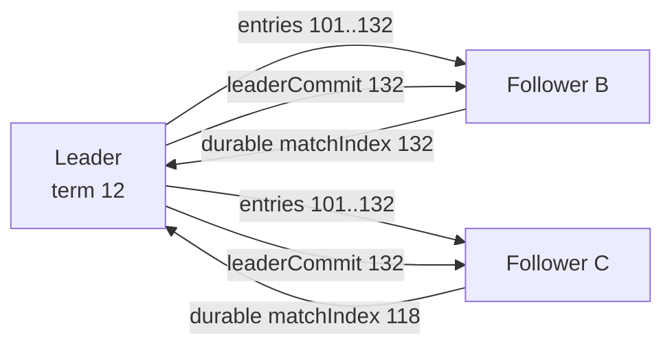
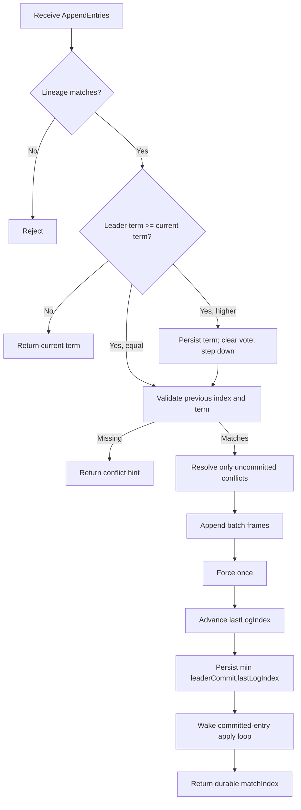
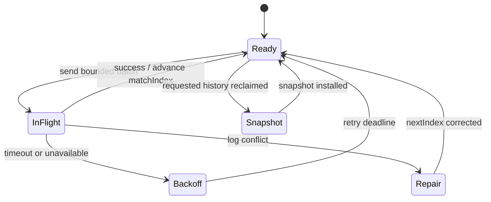

# Appendix B — Replication Protocol

## Status

**Partially current.** v0.26 supplies ordered epoch-fenced follower append and
v0.27 supplies bounded HTTP batches. Elections, commit propagation, automatic
workers, and snapshot installation remain target behavior.

## Replica group



For replication factor three, leader plus one durable follower is a majority.
The lagging follower catches up without blocking majority progress.

## Entry identity

The target durable entry is:

```text
ReplicatedLogEntry
    lineage
    logTerm
    logIndex
    WalRecord
    checksum
```

`logIndex` is continuous within one lineage. `logTerm` identifies the elected
leader term in which the entry originated. Equality means term, index, and
content all match.

## AppendEntries-style exchange

```text
request
    lineage
    leaderId
    leaderTerm
    previousLogIndex
    previousLogTerm
    firstIndex
    entries[]
    leaderCommit

success response
    currentTerm
    matchIndex

rejection response
    currentTerm
    conflictIndex
    conflictTerm (when known)
```

The previous-index/term check establishes that leader and follower agree at the
point immediately before the batch. A first-sequence check alone finds gaps but
cannot efficiently repair a divergent suffix.

## Follower processing



The follower never truncates a committed entry. Any request requiring that is a
protocol-safety failure and must stop the replica.

## Leader progress

For each follower, the leader keeps:

| Field | Meaning |
|---|---|
| `nextIndex` | Next log index the leader will attempt to send |
| `matchIndex` | Highest index known durable on that follower |
| `inFlight` | At most one outstanding batch initially |
| `retryAt` | Backoff deadline after transport/storage failure |
| `lastContactAt` | Observability and health input, not commit authority |



## Partial and ambiguous batches

A batch is not transactionally atomic across records. A follower can force a
prefix and fail later. The response may also be lost after the whole batch is
durable. The leader retries the unchanged range; matching entries are
idempotent and application resumes at the first missing index.

## Catch-up choices

| Follower condition | Action |
|---|---|
| Slightly behind; entries retained | Send bounded WAL batches |
| Conflicting uncommitted suffix | Find matching prefix and replace suffix |
| Required prefix reclaimed | Install snapshot, then stream suffix |
| Wrong generation or partition | Reject; never repair across lineage |
| Corrupt or poisoned storage | Remove from service and rebuild replica |

## Flow control

Bound all of the following:

- entries and bytes per batch;
- one in-flight batch per follower initially;
- node-wide replication requests;
- uncommitted entries and bytes per partition;
- snapshot transfers and recovery bandwidth;
- exponential backoff and maximum retry delay.

Slow followers must not hold the partition mutation lock while waiting on the
network. If a majority cannot keep up and the uncommitted bound is reached, the
leader rejects or throttles new mutations rather than growing without limit.

## Election relationship

PostgreSQL does not pick the safe log. Voters compare candidate
`(lastLogTerm, lastLogIndex)` and grant at most one durable vote per term. The
candidate needs a majority of the current voting membership. Metadata observes
the resulting leader for discovery and placement operations.
