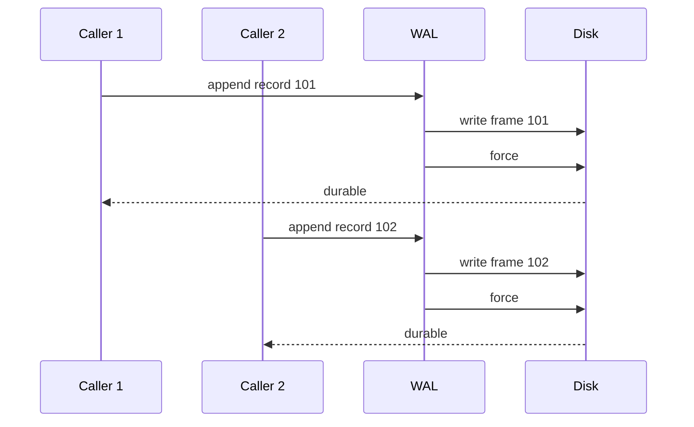
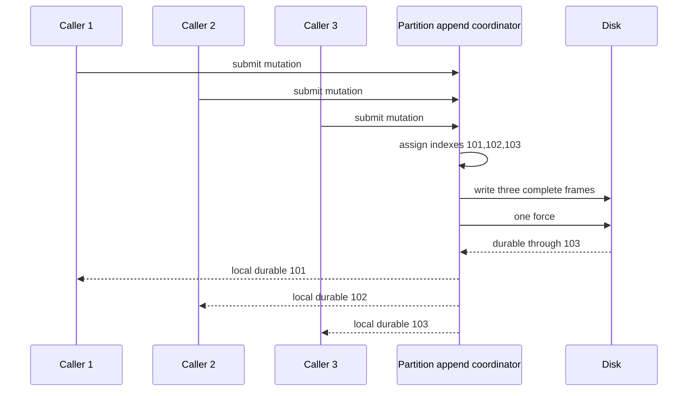
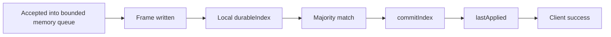

# Appendix C — Group Commit and Durability

## Status

**Target design requiring v0.27.1 benchmarks.** Current WAL append forces every
record, including every record inside a received follower batch.

## Current write path



This is simple and strong, but throughput is bounded by forced-write latency.
Naive quorum replication repeats that cost on followers for every record.

## Target group-commit path



All callers retain the same guarantee: success is unavailable until their frame
is forced. Group commit changes physical cost, not the durability contract.

## Durability stages



| Stage | Survives process crash? | Survives leader disk loss? | Client success allowed? |
|---|---:|---:|---:|
| Accepted in memory | No | No | No |
| Written, not forced | Not guaranteed | No | No |
| Locally forced | Yes on leader disk | No | No under quorum policy |
| Majority durable | Yes | Yes for tolerated failures | Not until commit/apply boundary |
| Committed and applied | Yes | Yes for tolerated failures | Yes |

## Append coordinator responsibilities

One coordinator per active partition logically owns:

- bounded admission of pending mutations;
- revalidation of leader role and term;
- consecutive index assignment;
- frame encoding and ordered writes;
- group formation by byte, entry, and delay limits;
- one force for the group;
- advancement of `durableIndex`;
- handoff to replication;
- completion or failure of waiting operations.

This does not require one platform thread per partition. Candidate execution
models must be benchmarked:

| Model | Benefit | Risk |
|---|---|---|
| Virtual thread per active partition | Simple ownership model | Large timer/queue population for many active partitions |
| Shared executor with partition-affine tasks | Bounded threads | Fairness and rescheduling complexity |
| Node-wide group commit across partitions | Maximum force amortization | Couples unrelated partition latency and failure handling |

Start by benchmarking per-partition grouping. Do not introduce node-wide shared
WAL files; they make partition recovery and corruption isolation harder.

## Batch thresholds

A group closes when the first threshold is reached:

```text
maximumEntries
OR maximumBytes
OR maximumDelay
```

The delay bounds latency during low traffic, while entry and byte limits bound
memory and write monopolization. Initial benchmark candidates:

| Parameter | Candidate values |
|---|---|
| Entries | `1`, `8`, `32`, `128`, `256` |
| Payload | `128 B`, `1 KiB`, `16 KiB`, `256 KiB` |
| Maximum delay | `0`, `0.25 ms`, `0.5 ms`, `1 ms`, `2 ms` |
| Producers | `1`, `4`, `16`, `64` |

## Follower group force

The follower validates the complete batch framing and ordering, writes frames
sequentially, then forces once. A successful response means every entry through
`matchIndex` is durable.

An I/O exception may make the exact durable prefix uncertain. The follower
poisons the active writer, recovers/tail-validates storage, and relies on exact
entry retry to determine which prefix exists. It must not acknowledge the
requested end index when force did not report success.

## What `force(true)` means here

`FileChannel.force(true)` requests both file content and metadata updates. It
does not protect against lying hardware, disabled drive cache protection,
filesystem defects, or correlated loss of all replicas. Benchmarks must record
filesystem, storage medium, mount/container environment, JDK, and host details.

Whether established preallocated files can safely use `force(false)` is a later
measurement and filesystem-semantics decision. Never change it solely because a
microbenchmark is faster.

## v0.27.1 benchmark matrix

Measure throughput plus p50, p95, p99, p99.9, and maximum latency for:

1. single forced WAL append;
2. current follower batch with force per record;
3. prototype follower batch with one force;
4. concurrent producers by payload and batch size;
5. segment rotation;
6. foreground append during snapshot creation;
7. foreground append during snapshot installation;
8. HTTP serialization without disk;
9. end-to-end follower HTTP plus disk force;
10. many idle and active partition runtimes.

Store raw JMH JSON under `docs/benchmarks/v0.27.1/`, plus environment metadata
and a Markdown interpretation. Optimization enters production only when a
measured bottleneck and unchanged invariant are both demonstrated.
