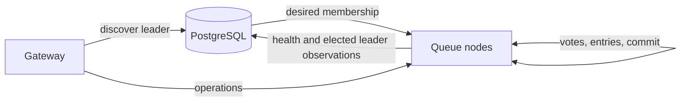
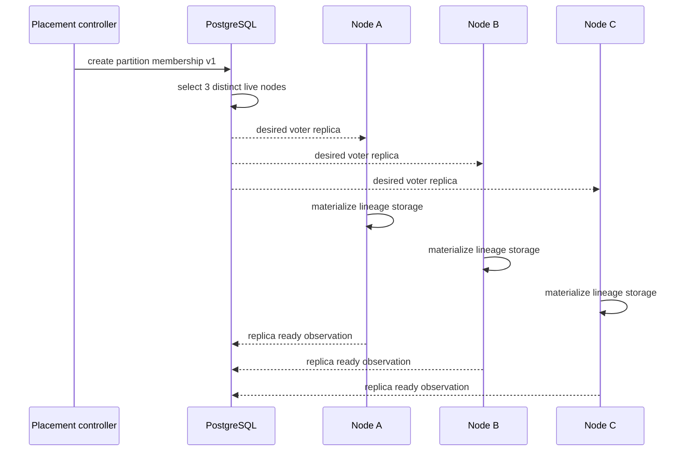

# Appendix D — Metadata Model

## Status

**Target logical schema.** Existing tables remain authoritative for current
single-placement behavior. Names below guide future migrations; they are not yet
implemented.

## Ownership boundary



PostgreSQL owns configuration and desired topology. Replica quorum owns term,
vote, log, and commit truth.

## Queue generation

Proposed `queue_generations` additions:

| Column | Type | Constraint | Meaning |
|---|---|---|---|
| `queue_id` | UUID | PK component, FK queue | Stable queue identity |
| `generation_id` | UUID | PK component | Queue incarnation |
| `partition_count` | INTEGER | `> 0`, immutable | Number of ordering shards |
| `replication_factor` | INTEGER | initially `IN (1,3)` | Voting copies per partition |
| `partition_hash_version` | INTEGER | immutable | Stable keyed-routing algorithm |
| `state` | TEXT | lifecycle enum | Creating, active, deleting, deleted |
| `metadata_version` | BIGINT | monotonic | Optimistic concurrency fence |

Changing partition count or hash version requires a new generation until an
explicit online repartitioning protocol exists.

## Partition

Proposed `queue_partitions`:

| Column | Type | Constraint | Meaning |
|---|---|---|---|
| `queue_id` | UUID | PK/FK component | Queue identity |
| `generation_id` | UUID | PK/FK component | Generation identity |
| `partition_id` | INTEGER | PK component, `>= 0` | Partition identity |
| `membership_version` | BIGINT | positive, monotonic | Replica-set configuration version |
| `desired_state` | TEXT | enum | Active, draining, deleting |
| `created_at` | TIMESTAMPTZ | not null | Audit time |
| `updated_at` | TIMESTAMPTZ | not null | Audit time |

`membership_version` fences stale control-plane reconciliation. It is distinct
from election term: membership describes who may vote; term describes current
consensus authority.

## Partition replica

Proposed `partition_replicas`:

| Column | Type | Constraint | Meaning |
|---|---|---|---|
| `replica_id` | UUID | PK | Stable identity for this membership copy |
| lineage columns | UUID/INTEGER | FK partition | Logical history copied |
| `node_id` | TEXT | FK node | Desired physical host |
| `member_role` | TEXT | `VOTER` or `LEARNER` | Consensus participation |
| `desired_state` | TEXT | enum | Provisioning, active, draining, removing |
| `membership_version` | BIGINT | FK/version match | Configuration fence |
| `created_at` | TIMESTAMPTZ | not null | Audit time |
| `updated_at` | TIMESTAMPTZ | not null | Audit time |

Recommended constraints:

```text
UNIQUE(queue_id, generation_id, partition_id, node_id)
UNIQUE(queue_id, generation_id, partition_id, replica_id)
```

These prevent two copies of one partition being assigned to the same node and
prevent duplicate replica identity.

## Replica observation

Proposed `partition_replica_status` is replaceable observation, not durable log
authority:

| Column | Type | Meaning |
|---|---|---|
| `replica_id` | UUID | Observed replica |
| `node_id` | TEXT | Reporting node |
| `registration_epoch` | BIGINT | Reporting process fence |
| `membership_version` | BIGINT | Membership being reported |
| `runtime_state` | TEXT | Recovering, follower, candidate, leader, failed |
| `observed_term` | BIGINT | Informational highest term |
| `last_log_index` | BIGINT | Informational durable log end |
| `commit_index` | BIGINT | Informational committed prefix |
| `last_applied` | BIGINT | Informational state-machine progress |
| `snapshot_index` | BIGINT | Informational installed snapshot boundary |
| `last_heartbeat_at` | TIMESTAMPTZ | Liveness observation |
| `failure_reason` | TEXT | Bounded diagnostic text |

No election may choose a leader merely by sorting this table. Values can be
stale, delayed, or missing.

## Leader observation

Proposed `partition_leader_observations`:

| Column | Type | Meaning |
|---|---|---|
| lineage columns | UUID/INTEGER | Partition |
| `leader_replica_id` | UUID | Self-reported elected leader |
| `leader_node_id` | TEXT | Routing endpoint lookup |
| `term` | BIGINT | Election term |
| `membership_version` | BIGINT | Election membership |
| `reported_at` | TIMESTAMPTZ | Freshness |

Metadata accepts a report only from a current registered replica in the stated
membership. Conflicting reports in one term are an alert and routing must fail
closed; PostgreSQL does not resolve the conflict by last-write-wins.

## Durable replica-local hard state

The following does **not** belong in PostgreSQL:

| Field | Local durability reason |
|---|---|
| `currentTerm` | Must fence stale terms even when metadata is unavailable |
| `votedFor` | Must prevent two votes in one term across restart |
| `commitIndex` | Defines locally safe apply prefix |
| log entries | Message durability authority |
| snapshot and included index/term | Replica recovery authority |

Store hard state beside the partition replica using version, lineage,
membership identity, checksum, atomic replacement, and directory durability.

## Initial placement transaction



For a new empty partition, bootstrap can deterministically nominate one node to
start term one. Existing-data reassignment cannot use this shortcut.

## Future membership change

Replacing a failed voter is not `DELETE old; INSERT new`:

```text
add replacement as learner
    ↓
snapshot/WAL catch-up
    ↓
verify committed prefix
    ↓
joint old+new membership
    ↓
promote learner and remove failed voter
```

Until joint-consensus implementation exists, membership remains immutable and
replacement requires an explicitly unavailable/manual workflow.
