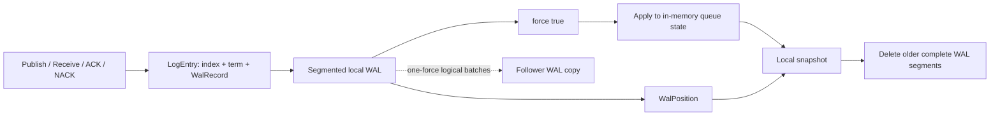
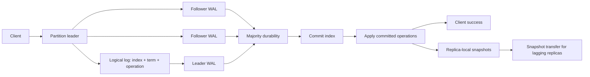
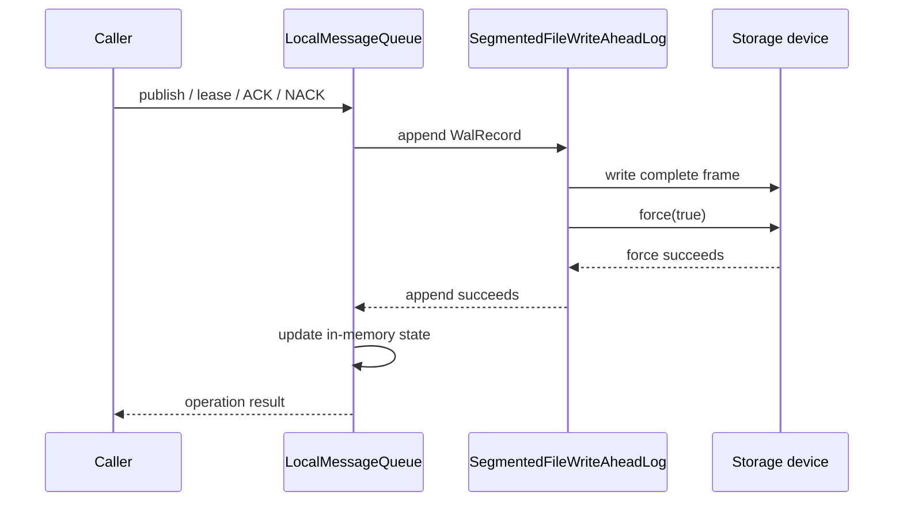
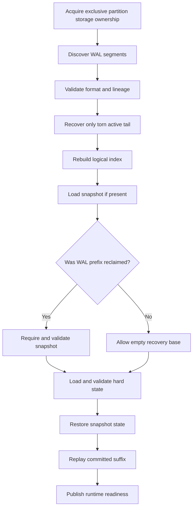

# Storage Architecture — Current and Target System

## Purpose

This document explains how queue data is stored today and how that storage will
grow into replicated distributed storage. It uses plain language first and then
shows the lower-level files, fields, APIs, recovery steps, and failure rules.

## How to read this document

- **Current storage** explains behavior that exists in the repository today.
- **Target storage** explains the intended end state without assigning features
  to releases.
- **Target rules** collect authority, recovery, failure, and concurrency
  invariants that implementation work must preserve.

Statements in the target sections are designs, not current guarantees.

The most important idea is that the system has three different kinds of state:

```text
Queue state       What messages are ready, leased, delayed, or dead-lettered
Logical history   Which ordered operations created that state
Physical storage  Which files and byte offsets contain that history
```

These concepts are related, but they are not interchangeable.

## One-page view

### Current system



Today, each partition is a durable local queue. A follower can store an ordered
logical copy whose identity survives prefix reclamation, but the system does
not automatically choose replicas, replicate every operation, calculate
majority commit, elect a leader, or promote a follower.

The same current path in a terminal-friendly form is:

```text
caller
  |
  v
LocalMessageQueue
  |
  | append before mutation
  v
LogEntry(index, term, WalRecord) -> WAL segment -> force(true)
                              |
                              | success
                              v
                    in-memory queue state
                              |
                              v
                         snapshot.bin
                              |
                              v
                 reclaim older WAL segments
```

### Target system



The target keeps one logical history per partition and stores a copy on several
nodes. A client operation succeeds only after a majority has stored it and the
leader has applied the committed operation.

```text
                         metadata / placement
                                  |
                                  v
client -> router -> partition leader (node A)
                         |       |       |
                         |       |       +--> follower (node C)
                         |       +----------> follower (node B)
                         +------------------> leader-local storage
                                  |
                      majority durable acknowledgement
                                  |
                                  v
                         advance commitIndex
                                  |
                                  v
                    apply committed queue operation
                                  |
                                  v
                           respond to client

Each replica owns independently recoverable storage:

  replica-hard-state.bin + snapshot.bin + retained WAL suffix
                                      |
                                      v
                           materialized queue state
```

## Storage identity

Every partition storage directory belongs to one immutable lineage:

```text
StorageLineage(
    queueId,
    generationId,
    partitionId
)
```

- `queueId` identifies the customer queue.
- `generationId` prevents a deleted and recreated queue from reusing old data.
- `partitionId` identifies one independently ordered shard of the queue.

Every WAL segment and snapshot stores this lineage. A mismatch stops recovery.
Filesystem paths are useful organization, but the identity inside the files is
the authority.

## Current partition layout

The queue node constructs the path from the lineage:

```text
<storage-root>/
└── <queue-id>/
    └── <generation-id>/
        └── partition-<partition-id>/
            ├── wal/
            │   ├── segment-000000.wal
            │   ├── segment-000001.wal
            │   └── ...
            ├── snapshot.bin
            └── replica-leader-epoch.bin   // follower storage only
```

Not every file must exist:

- a new partition starts with WAL segment zero;
- `snapshot.bin` appears after the first successful checkpoint;
- `replica-leader-epoch.bin` appears when follower authority is recorded.

## Current write path

The queue uses WAL-first mutation ordering:



The in-memory state changes only after the WAL append reports success. If the
process crashes after the force but before the memory change, recovery replays
the record. If WAL writing fails, the writer is poisoned because the exact tail
on storage may be uncertain.

### Current WAL record

`WalRecord` describes a queue state transition. Its fields are:

```text
type
messageId
payload
receiptHandle
attempt
timestamp
```

Record types are publish, lease start, acknowledgement, NACK, lease expiry, and
dead-letter transition.

### Current frame format

Each record is stored as:

```text
+-------------------+----------------------+------------------+
| payload length    | serialized WalRecord | CRC32C checksum  |
| 4 bytes           | N bytes              | 4 bytes          |
+-------------------+----------------------+------------------+
```

The checksum covers the serialized record. It detects accidental corruption;
it does not provide encryption or protection against malicious modification.

### Current segment header

Every segment begins with:

```text
+-------------------+----------------------+
| magic DQWL        | 4 bytes              |
| format version 2  | 4 bytes              |
| queue UUID        | 16 bytes             |
| generation UUID   | 16 bytes             |
| partition ID      | 4 bytes              |
+-------------------+----------------------+
```

All values use big-endian byte order through Java `ByteBuffer`.

## Rotation and torn-tail recovery

A segment rotates after it reaches the configured target size. Rotation is an
authority change, so it follows a durable publication sequence:

```text
create next .tmp segment
    ↓
write and force its header
    ↓
atomically rename it to .wal
    ↓
force the parent directory
    ↓
open it as the active segment
    ↓
close the previous active channel
```

A failure before rename leaves the previous segment authoritative. A failure
after rename poisons the current writer because the durable authority may have
moved even if the process did not finish switching channels.

During recovery:

- a complete checksum-valid frame is accepted;
- a torn final frame in the active segment is removed;
- a torn or corrupt sealed segment fails recovery;
- unexpected gaps or mixed lineages fail recovery.

Only the active tail can be repaired because an incomplete older segment would
mean later history was built on an invalid prefix.

## Current snapshots

A snapshot stores the complete materialized queue state:

```text
storage lineage
WalPosition
ready messages
in-flight messages and leases
delayed messages
dead-letter messages
```

`WalPosition(segmentId, offset)` points to the first WAL byte not represented by
the snapshot.

```text
WAL:      [record 1][record 2][record 3]|[record 4][record 5]
                                           ^
snapshot position -------------------------+

Snapshot contains the effects of records 1–3.
Recovery replays records 4–5.
```

### Snapshot publication

```text
capture immutable queue state and WalPosition
    ↓
write snapshot.bin.tmp
    ↓
force the candidate file
    ↓
atomically replace snapshot.bin
    ↓
force the parent directory
```

The temporary file is never authoritative. If promotion does not complete, the
previous snapshot remains the recovery authority.

## Current recovery authority

Before WAL reclamation, the full WAL can rebuild the queue by itself. After a
snapshot authorizes deletion of old segments, recovery requires two artifacts:

```text
authoritative snapshot + retained WAL suffix = complete recoverable state
```

The current rule is:

```text
first retained segment is segment 0
    → WAL-only recovery is allowed

first retained segment is greater than 0
    → a valid matching snapshot is mandatory
```

If the mandatory snapshot is missing or corrupt, startup fails. Replaying only
the retained suffix could produce a believable but incomplete queue, which is
more dangerous than refusing service.

## Current compaction

Compaction deletes only complete segments before the snapshot's segment:

```text
snapshot position = segment 5, offset 9000

delete:  segments 0, 1, 2, 3, 4
retain:  segment 5 from its full file, plus all later segments
```

The system does not rewrite the beginning of segment 5. This keeps compaction
simple and preserves the physical position stored by the snapshot.

The safe order is:

```text
validate candidate position
    ↓
durably publish snapshot
    ↓
advance in-memory compaction boundary
    ↓
delete covered complete segments
    ↓
force the WAL directory
```

Deletion failure does not invalidate the snapshot. It only leaves extra safe
history that can be reclaimed later.

## Current storage components

| Component | Current responsibility |
|---|---|
| `LocalMessageQueue` | Applies state transitions and reconstructs queue state |
| `WriteAheadLog` | Appends and reads `WalRecord` values |
| `ReplicatedLog` | Exposes logical append, retry, conflict, and bounded-read semantics |
| `SegmentedFileWriteAheadLog` | Stores indexed/termed entries and owns rotation, force, and recovery |
| `WalHeaderCodec` | Encodes version and storage lineage |
| `WalFrameCodec` | Checksums index, term, and queue mutation in one frame |
| `FileQueueSnapshotStore` | Publishes logical/physical snapshot authority |
| `SnapshotCompactionCoordinator` | Allows deletion only after snapshot authority exists |
| `StorageLifecycleManager` | Periodically decides whether to snapshot and compact |
| `LocalQueueStorageProvisioner` | Creates or validates an empty lineage-bound WAL |
| `LocalRuntimeQueueFactory` | Opens WAL, snapshot store, and local queue runtime |
| `OrderedFollowerReplicaLog` | Enforces follower order, retry, conflict, and durable term fence |
| `FileReplicaHardStateStore` | Publishes lineage-bound term, vote, and commit authority |

## Resolved follower sequence limitation

The previous follower stored only `WalRecord` in the WAL. Its sequence was
reconstructed from the number of records loaded at startup:

```text
expected sequence = records.size() + 1
```

That fails after old records are reclaimed. If the first 1,000 records are in a
snapshot and deleted from the WAL, the retained list may contain 20 records.
The next logical index is 1,021, not 21.

The current durable logical log solves this by storing the permanent index and
term in every frame and restoring a reclaimed boundary from the snapshot.

---

## Target storage architecture

The target is a replicated state machine per queue partition. The control plane
decides desired membership and placement. The data-plane replica group owns the
ordered history, leader authority, durability quorum, commit decision, and
recovery of that partition.

```text
                            CONTROL PLANE
            queue definitions, replica count, desired placement
                                    |
                                    | desired membership
                                    v
 +-------------------------------------------------------------------+
 |                    PARTITION REPLICA GROUP                         |
 |                                                                   |
 |  client request                                                    |
 |       |                                                           |
 |       v                                                           |
 |  elected leader ---- append entries ----+---- follower B          |
 |       |                                  +---- follower C          |
 |       |                                                           |
 |       +---- majority durable ----> commitIndex ----> apply         |
 +-------------------------------------------------------------------+
              |                      |                    |
              v                      v                    v
       replica A storage      replica B storage    replica C storage
       hard state             hard state           hard state
       snapshot               snapshot             snapshot
       WAL suffix             WAL suffix           WAL suffix

The control plane may report where replicas should run. It is not in the
message acknowledgement path and it does not decide which log entries commit.
```

The target storage stack within each replica is:

```text
replication / election protocol
              |
              v
logical replicated log: (index, term, operation)
              |
       +------+------------------+
       |                         |
       v                         v
segmented WAL              replica hard state
durable log entries        currentTerm, votedFor, commitIndex
       |
       v
committed-entry replay -> queue state machine
       |                         |
       +------------+------------+
                    v
             replica-local snapshot
             included index + term
             queue state + local WAL position
                    |
                    v
          snapshot-authorized WAL reclamation
```

Its core ordering invariant is:

```text
snapshot.lastIncludedIndex <= lastApplied <= commitIndex <= lastLogIndex
```

An implementation may temporarily have no snapshot or no suffix, but it must
never expose applied state beyond the committed boundary.

## Durable logical log

Each target WAL frame stores:

```text
LogEntry(
    logIndex,
    logTerm,
    WalRecord
)
```

The new frame will be:

```text
+-------------------+----------------------------------+
| payload length    | 4 bytes                          |
+-------------------+----------------------------------+
| log index         | 8 bytes                          |
| log term          | 8 bytes                          |
| record length     | 4 bytes                          |
| WalRecord bytes   | N bytes                          |
+-------------------+----------------------------------+
| CRC32C            | index + term + record payload    |
+-------------------+----------------------------------+
```

The target segment header format is version 3. The repository rejects version-2
storage rather than implement migration.

### Why index and term are both needed

`logIndex` answers “where is this operation in the partition history?”

`logTerm` answers “which leader term originally created this operation?”

Together they identify a log point:

```text
(logIndex, logTerm)
```

Two replicas agreeing only on index may still have different operations at that
index. Comparing the term and content detects this disagreement.

### Logical and physical positions remain separate

```text
Logical point:   LogPoint(index=1042, term=17)
Physical point:  WalPosition(segment=8, offset=9216)
```

The logical point is used for replication and future election safety. The
physical point is used to open files, replay bytes, and delete segments.

### Snapshot authority

Target snapshots contain:

```text
storage lineage
lastIncludedIndex
lastIncludedTerm
local WalPosition
materialized queue state
```

`lastIncludedTerm` is the term of the entry at `lastIncludedIndex`, not the
replica's current term and not the term active when the snapshot is created.

### Replica hard state

The follower's separate epoch file becomes:

```text
replica-hard-state.bin

currentTerm
votedFor
commitIndex
storage lineage
format version
CRC32C
```

It is written as a candidate, forced, atomically promoted, and followed by a
directory force. `lastApplied` is not independently persisted because the
corresponding in-memory queue state would be lost on restart. It is recovered
from the snapshot boundary and committed-log replay.

### Durable batches

The current follower writes and forces each record separately. The checked-in
benchmark evidence shows that force count dominates batch time.

The target log validates a complete bounded batch, writes all new frames to one
segment, and calls `force(true)` once:

```text
validate entries 101–132
    ↓
write complete frames 101–132
    ↓
one force
    ↓
report durable through 132
```

A batch is one success durability boundary, not an all-or-nothing transaction.
If a write or force fails, a complete prefix may exist. The writer is poisoned,
restart discovers the prefix, and an unchanged retry continues safely.

## Replica group and storage roles

Metadata defines which nodes should store each partition:

```text
partition 0
├── node A: voter, current leader
├── node B: voter, follower
└── node C: voter, follower
```

Provisioning creates an empty storage bundle:

```text
partition-N/
├── wal/segment-000000.wal
└── replica-hard-state.bin
```

Provisioning only establishes local lineage and empty durable authority. It
does not copy data or make the replica ready. Bootstrap is a separate process.

The node must never host two replicas of the same lineage, and two processes
must not open the same local storage concurrently.

### Replica-group model

One queue partition maps to one independent replica group. A node may host many
replicas belonging to different customers and queues, but it hosts at most one
member of any particular group.

```text
Node A                              Node B
├── customer-1 / queue-orders / P0  ├── customer-1 / queue-orders / P0
│   role: leader                    │   role: follower
├── customer-1 / queue-orders / P1  ├── customer-2 / queue-email / P0
│   role: follower                  │   role: leader
└── customer-3 / queue-jobs / P2    └── customer-3 / queue-jobs / P2
    role: follower                      role: follower

Each line is separate storage, locking, recovery, replication, and failure
authority. A node failure affects several groups, but each surviving group
independently decides whether it still has a quorum.
```

The replication factor is queue-generation configuration, with a target
default of three. Three replicas tolerate one unavailable replica while still
forming a majority of two. Placement should use distinct nodes and, when the
deployment knows them, distinct failure domains.

Replica roles are deliberately different:

| Role | Durable data | Votes | Can lead | Purpose |
|---|---|---:|---:|---|
| Leader | Full log, hard state, snapshots | Yes | Already leader | Orders operations and advances commit |
| Follower voter | Full log, hard state, snapshots | Yes | If eligible | Participates in quorum and failover |
| Learner | Full bootstrap data | No | No | Catches up without changing quorum safety |

All roles use the same durable file formats. This avoids a special follower
format that would need conversion during promotion.

### Leader-side replication progress

For every follower, the leader tracks volatile progress:

```text
nextIndex   first log index the leader should send next
matchIndex  highest log index known durable on that follower
```

```text
leader log:       101 102 103 104 105 106 107 108
leader durable:    Y   Y   Y   Y   Y   Y   Y   Y
follower B:        Y   Y   Y   Y   Y   Y   -   -   matchIndex=106
follower C:        Y   Y   Y   Y   -   -   -   -   matchIndex=104
                                      ^
                                      majority durable through 106
```

`nextIndex` and `matchIndex` can be rebuilt after leadership changes. In
contrast, `currentTerm`, `votedFor`, and the safe committed boundary require
durable authority.

### Replica readiness and promotion

```text
UNASSIGNED
    |
    v
PROVISIONED -> LEARNER -> CATCHING_UP -> READY_VOTER
                                  |             |
                                  |             +-> FOLLOWER
                                  |                    |
                                  |                    +-> LEADER (after election)
                                  v
                                FAILED -> rebuild as learner
```

A replica is eligible for promotion only when:

- its lineage and membership match the replica group;
- it is a voter, not a learner;
- its log is sufficiently up to date under the election rule;
- its snapshot and retained suffix form one valid history;
- it has no corruption or poisoned-writer condition;
- it has applied all entries through its committed boundary;
- it has durably recorded the new term before serving leader traffic.

Placement metadata alone does not make a replica ready or safe to promote.

## Replica catch-up and snapshot installation

A follower that is slightly behind can receive retained log entries:

```text
follower last index = 800
leader retains       801..1000
action                send log batches
```

A follower that needs reclaimed history requires a snapshot:

```text
follower last index             = 200
leader snapshot included index  = 700
leader first retained entry     = 701
action                           install snapshot, then send 701 onward
```

### Transfer snapshot versus local snapshot

A snapshot sent over the network must not contain a leader-local
`WalPosition` as follower authority. Physical positions differ between nodes.

Portable snapshot content:

```text
storage lineage
lastIncludedIndex
lastIncludedTerm
materialized queue state
checksum and transfer metadata
```

Follower-local authoritative snapshot:

```text
storage lineage
lastIncludedIndex
lastIncludedTerm
follower-local WalPosition
materialized queue state
```

Installation converts portable logical state into follower-local physical
authority. It must atomically coordinate the new snapshot, logical log base,
hard state, and local WAL suffix.

After catch-up, every replica creates and maintains its own snapshots. Snapshot
transfer is required only when the source no longer retains the log history the
follower needs.

```text
                    Can the leader provide followerNextIndex?
                                  |
                         +--------+--------+
                         |                 |
                        yes                no
                         |                 |
                         v                 v
                 stream WAL entries   choose snapshot S
                         |                 |
                         |          send portable state
                         |                 |
                         |          verify lineage/checksum
                         |                 |
                         |          atomically install S
                         |                 |
                         +--------> append entries after S
                                           |
                                           v
                                    become READY only
                                    after validation
```

The source snapshot carries logical authority. The receiving replica creates
its own physical WAL position; copying the source's byte offset would confuse
logical agreement with source-local file layout.

## Majority commit and committed-only apply

With replication factor three, a majority is two replicas. A leader tracks:

```text
node A matchIndex = 120
node B matchIndex = 120
node C matchIndex = 107

majority commitIndex = 120
```

The storage stages become:

```text
accepted in memory
    ↓
leader locally durable
    ↓
followers replicate
    ↓
majority durable
    ↓
commitIndex advances
    ↓
state machine applies committed entries
    ↓
client receives success
```

Uncommitted entries may exist in WAL files, but they must not change customer-
visible queue state. A new leader may later replace an uncommitted conflicting
suffix. A committed entry must never be removed.

```text
publish X
   |
   v
leader assigns (index=121, term=9)
   |
   +--> leader WAL force --------------------- ack A
   +--> follower B validate + WAL force ------ ack B
   +--> follower C delayed
                    |
                    v
          A + B form majority of 3
                    |
                    v
           commitIndex advances to 121
                    |
                    v
       apply X to leader queue state
                    |
                    v
              return success
```

The log index is assigned as part of the serialized leader append, not by the
client and not by the metadata service. This gives one authority for ordering
and prevents two concurrent publishes from receiving the same index.

## Election, repair, and promotion

Election uses the candidate's last `(term,index)` to prevent an out-of-date
replica from becoming leader. `currentTerm` and `votedFor` must be durable before
a vote response is sent.

Repair will add:

- conflict discovery by previous index and term;
- truncation of uncommitted conflicting suffixes;
- learner bootstrap before voter promotion;
- snapshot installation after history reclamation;
- replacement of permanently failed replicas;
- bounded recovery concurrency and bandwidth.

The metadata database observes placement and reported leadership. It does not
vote, select the safe log, or participate in message commit.

```text
old leader A fails
       |
       v
B and C exchange term + last log point
       |
       v
majority grants at most one durable vote per term
       |
       v
winner records new term and becomes leader
       |
       +--> preserve every committed entry
       +--> repair uncommitted conflicting suffixes
       +--> resume replication before serving as healthy
```

## Target partition layout

```text
<storage-root>/
└── <queue-id>/
    └── <generation-id>/
        └── partition-<partition-id>/
            ├── wal/
            │   ├── segment-000042.wal
            │   ├── segment-000043.wal
            │   └── segment-000044.wal
            ├── snapshot.bin
            └── replica-hard-state.bin
```

Possible later additions must be justified by a real need:

```text
snapshot transfer candidate files
rebuildable sparse-index sidecar
storage manifest for atomic multi-artifact installation
```

They are design options, not requirements merely because other queue products
use them.

### Authority inside one replica directory

```text
partition-N/
|
+-- replica-hard-state.bin
|     currentTerm -------- prevents stale-term authority
|     votedFor ----------- prevents two votes in one term
|     commitIndex -------- upper bound safe to apply
|
+-- snapshot.bin
|     lineage ------------ prevents cross-queue recovery
|     lastIncludedIndex -- logical state boundary
|     lastIncludedTerm --- history identity at boundary
|     local WalPosition -- local reclamation boundary only
|     queue state -------- materialized committed state
|
+-- wal/
      segment-*.wal ------ entries after/before snapshot as retained
      each entry --------- index + term + queue operation + checksum

Recovery agreement:

  snapshot boundary + checksum-valid WAL suffix + hard-state commit boundary
                              |
                              v
                   one committed queue history
```

## Target startup sequence



The partition must not become READY until every durable artifact agrees.

```text
lock directory
    |
discover and validate lineage of every artifact
    |
repair only an allowed torn active WAL tail
    |
load hard state + snapshot + logical WAL index
    |
verify snapshot <= commitIndex <= durable log end
    |
restore snapshot state
    |
replay only committed suffix
    |
publish READY

Any failed validation ---------------------------------> remain unavailable
```

## Target authority rules

| Question | Durable authority |
|---|---|
| Which queue history is this? | `StorageLineage` in all artifacts |
| What operation is at a log point? | WAL entry `(index, term, record)` |
| What is durably stored locally? | Last checksum-valid forced log prefix |
| What is safe to apply? | `commitIndex` |
| What state is already materialized in a snapshot? | Snapshot state through `(lastIncludedIndex,lastIncludedTerm)` |
| Where does local replay begin? | Snapshot's local `WalPosition` |
| Which old segments may be deleted? | Durably published snapshot position |
| Which term and vote survive restart? | Replica hard state |
| Which node may serve writes? | Elected leader term plus runtime authority |

## Failure policy

The storage layer favors refusing service over returning plausible but incorrect
state.

| Failure | Response |
|---|---|
| Checksum mismatch | Fail recovery |
| Mixed storage lineage | Fail recovery |
| Unsupported format | Fail with explicit version error |
| Torn active tail | Remove torn bytes and recover complete prefix |
| Torn sealed segment | Fail recovery |
| Write or force ambiguity | Poison writer until reopen |
| Missing required snapshot | Fail recovery |
| Snapshot logical/physical mismatch | Reject snapshot |
| Hard-state commit beyond durable log | Fail recovery |
| Reclaimed follower history | Request snapshot installation |
| Snapshot installation interrupted | Recover old or fully installed authority; never mix |

## Concurrency model

Each partition owns its storage ordering. Unrelated partitions should not share
a correctness lock.

Initial lock order:

```text
queue mutation/admission
    ↓
replicated log append
    ↓
replica hard state, when required
```

- index assignment and WAL append happen under one per-partition log lock;
- a batch does not span two WAL segments;
- no node-wide lock is held during storage force;
- snapshot encoding and file I/O occur outside the short queue-state capture
  lock where the immutable captured boundary permits it;
- network calls never hold the queue mutation or storage append lock.

## Capacity and performance direction

The main measured bottleneck is one `force(true)` per record. The near-term
optimization is per-partition durable batching, not weaker checksums or skipped
durability.

Future measurements must cover:

- group size, payload size, and maximum batching delay;
- foreground p99 during snapshots and replica recovery;
- startup with many local partitions;
- logical-index memory cost;
- follower lag and retained-WAL growth;
- snapshot transfer bandwidth and install time;
- quorum acknowledgement latency;
- slow and unavailable follower behavior.

Node-wide shared WAL files are not planned. They could amortize forces across
partitions but would couple corruption, recovery, deletion, and latency failure
domains.

## Component evolution

| Current component | Planned evolution |
|---|---|
| `WriteAheadLog<WalRecord>` behavior | Logical replicated-log operations over indexed/termed entries |
| `SegmentedFileWriteAheadLog` | Indexed frames, durable batch append, logical reads |
| `WalFrameCodec` | Checksum index, term, and record together |
| `QueueSnapshot` | Add last included index and term |
| `FileQueueSnapshotStore` | Stronger logical and physical boundary validation |
| `FileLeaderEpochStore` | Replace with replica hard-state store |
| `OrderedFollowerReplicaLog` | Validate previous log point and append durable groups |
| `LocalQueueStorageProvisioner` | Initialize WAL and empty hard state |
| `LocalRuntimeQueueFactory` | Open one consistent partition storage bundle |
| `StorageLifecycleManager` | Snapshot committed/applied boundary and reclaim safely |
| Replication scheduler | Maintain per-follower next and match indexes |
| Snapshot installer | Convert portable snapshot into local authority |

## Boundaries of the logical storage design

A durable logical log and one-force local batch durability alone cannot claim:

- that every partition has three replicas;
- that replication happens automatically;
- that client success survives leader-disk loss;
- that a follower is eligible for promotion;
- that two nodes can elect exactly one safe leader;
- that conflicting histories are repaired automatically.

Those guarantees exist only after their corresponding mechanisms and failure
tests are implemented.

## Related designs

- [Durable-log high-level design](v0.28-durable-log-hld.md)
- [Durable-log low-level design](v0.28-durable-log-lld.md)
- [ADR 0027](../adr/0027-durable-logical-replicated-log.md)
- [Target architecture](../distributed-queue-target-architecture.md)
- [Replication protocol](../architecture/appendix-b-replication-protocol.md)
- [Group commit and durability](../architecture/appendix-c-group-commit-and-durability.md)
- [Partition model](../architecture/appendix-a-partition-model.md)
- [Measured storage benchmarks](../benchmarks/v0.27.1/README.md)
