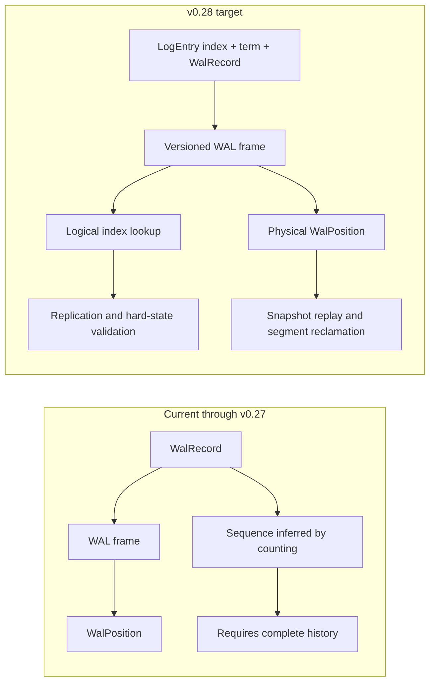
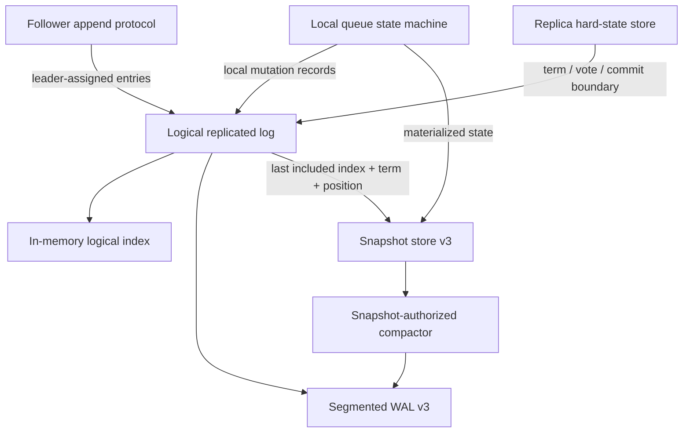
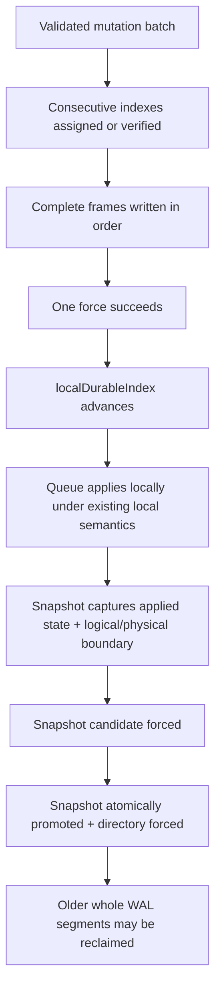
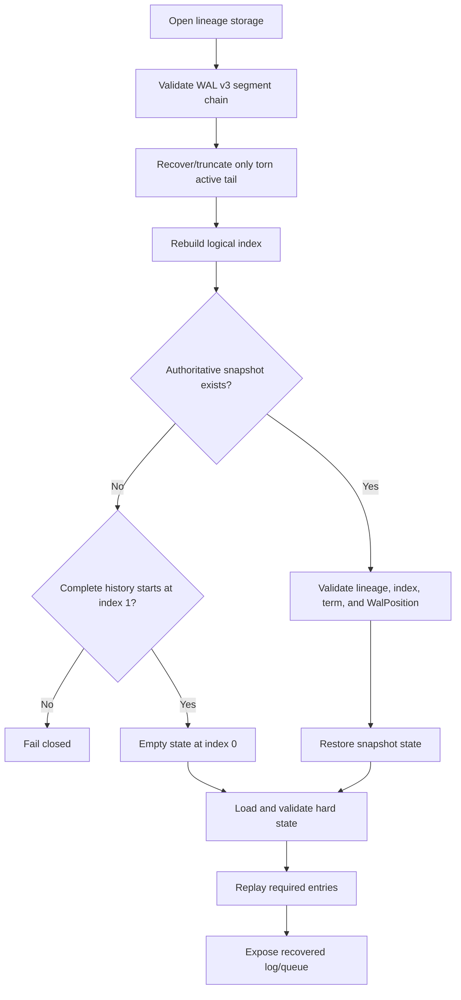

# v0.28 High-Level Design — Durable Logical Replicated Log

## Status

Accepted and implemented. This document records the reviewed architectural
boundary for v0.28.

## Purpose

v0.27 can copy bounded batches of `WalRecord` values to a follower, but its
sequence is reconstructed from the number of retained records. That is safe
only while the complete WAL starts at segment zero. A snapshot-authorized WAL
reclamation removes that prefix and destroys the count from which sequence was
derived.

v0.28 makes logical log identity durable and independent of physical files. It
also turns a transport batch into one local durability group, based on the
v0.27.1 benchmark evidence, without introducing quorum acknowledgement or
leader election.

## Current and target boundary



`logIndex` identifies an entry across rotation and reclamation. `WalPosition`
identifies a byte boundary in local storage. A snapshot binds both identities:

```text
SnapshotAuthority =
    lineage
    + lastIncludedIndex
    + lastIncludedTerm
    + walPosition
    + materialized queue state
```

## Goals

- Persist a consecutive logical index and originating term with every mutation.
- Read bounded entry ranges by logical index without counting reclaimed records.
- Preserve exact retry and conflict detection after restart and compaction.
- Persist replica hard state needed by later commit and election milestones.
- Make a successful batch append durable with one `force(true)`.
- Preserve current queue API and local delivery behavior.
- Keep physical corruption, lineage, and torn-tail checks fail-closed.
- Make snapshots authoritative for both state-machine and logical-log recovery.

## Non-goals

- Replica membership or automatic replication workers.
- Majority commit or distributed client acknowledgement.
- Leader election, heartbeat, or vote RPCs.
- Automatic conflicting-suffix truncation.
- Snapshot transfer or follower promotion.
- Multi-partition customer routing changes.
- Reading or migrating v0.27 storage formats.
- A persistent on-disk sparse index; v0.28 may rebuild it by scanning.
- Node-wide group commit across unrelated partitions.

## Architectural components



### Logical replicated log

The log is the ordered durable history for one `StorageLineage`. Each entry is:

```text
LogEntry(
    logIndex,
    logTerm,
    WalRecord
)
```

Lineage remains in every segment header and is not duplicated in every frame.
Indexes begin at one and never change because a segment rotates or is deleted.

### Physical segmented WAL

The segmented WAL remains the durable byte store. `WalPosition(segmentId,
offset)` continues to identify the first byte not represented by a snapshot.
Segment IDs and frame offsets are implementation details, not protocol indexes.

### Replica hard state

One lineage-bound, checksummed, atomically replaced file stores:

```text
currentTerm
votedFor
commitIndex
```

`lastApplied` is intentionally not an independently authoritative hard-state
field. Queue state is volatile between restarts; claiming an applied index
without its corresponding durable snapshot could skip required replay. On
recovery, `lastApplied` starts at `snapshot.lastIncludedIndex` and advances as
committed entries are replayed. This corrects the earlier delivery-plan wording.

### Snapshot authority

The snapshot format adds `lastIncludedIndex` and `lastIncludedTerm` while
retaining `WalPosition`. A snapshot is valid only when its state represents all
effects through `lastIncludedIndex`, and its physical position is immediately
after that same entry.

### Meaning of `lastIncludedTerm`

Every logical log entry has a stable identity made from two values:

```text
(logIndex, logTerm)
```

`lastIncludedIndex` is the highest log index whose effect is already contained
in the snapshot. `lastIncludedTerm` is the term stored on that exact entry.

For example:

```text
index       38   39   40   41   42
entry term   6    6    7    7    8
                         ^
snapshot contains state through index 40

lastIncludedIndex = 40
lastIncludedTerm  = 7
```

After entries 1–40 are reclaimed, the snapshot no longer has the physical log
frame for entry 40. Retaining `(40, 7)` preserves the identity of the compacted
log boundary. A leader can then prove that a follower and leader share the same
history immediately before sending entry 41.

The value is not the current term:

```text
currentTerm      = 12  // replica's present authority/election term
lastIncludedTerm = 7   // historical term of compacted entry 40
```

They may be equal, but often are not. Replacing `lastIncludedTerm` with
`currentTerm` would assign new historical identity to an old entry and could
make two different prefixes appear compatible.

`lastIncludedTerm` is required for:

- validating `previousLogIndex` and `previousLogTerm` at the snapshot boundary;
- detecting a follower whose compacted prefix differs from the leader's;
- comparing candidate log freshness during future leader elections;
- installing a snapshot without losing the logical identity of reclaimed data;
- rejecting a snapshot whose index claims one history while its term describes
  another.

For an empty log, the boundary is the sentinel `(0, 0)`. For a non-empty
snapshot, both values must be positive and must correspond to the same entry.

## Authority and durability chain



A write or force failure never advances `localDurableIndex`. The process cannot
know which prefix reached stable storage, so the writer is poisoned. Restart
scans frames, removes only a torn tail from the active segment, and reconstructs
the exact complete prefix before accepting another append.

## Batch durability semantics

The batch is a durability group, not a transactional database batch.

```text
success:
    every entry in the batch is complete and forced

failure before success:
    zero or more complete prefix entries may be recoverable
    no end-of-batch acknowledgement is permitted
    writer is poisoned until reopen and recovery

retry after recovery:
    identical prefix entries are ALREADY_PRESENT
    append resumes at the first absent index
```

This retains v0.27 ambiguous-response retry safety while reducing the normal
force count from `N` to one.

## Recovery overview



## Operating modes and guarantees

v0.28 preserves the existing single-node queue behavior. In local mode, a
forced local mutation may be applied and acknowledged according to existing
semantics. That is a **local commit policy**, not a majority commit claim.

The replicated-log primitives separately expose `localDurableIndex` and
`commitIndex`. Later v0.31 work will advance commit only from voting-majority
evidence and gate distributed client success on committed application.

| Guarantee | v0.28 |
|---|---|
| Logical entry identity survives restart/rotation | Yes |
| Logical identity survives snapshot reclamation | Yes, through snapshot boundary |
| Successful local batch uses one force | Yes |
| Exact retry after ambiguous failure | Yes |
| Majority-durable client acknowledgement | No |
| Automatic replication | No |
| Safe leader election | No |
| Divergent suffix repair | No |

## Main failure scenarios

| Failure | Required outcome |
|---|---|
| Crash while writing a batch frame | Recover complete prefix; discard torn active tail |
| `force` throws after writes | Poison writer; never acknowledge batch end |
| Crash after force before response | Exact retry detects identical durable entries |
| Segment rotation fails before promotion | Old segment remains authoritative; retry allowed |
| Rotation fails after promotion | Poison writer; restart discovers authoritative segment |
| Hard-state candidate write/force fails | Previous hard state remains authoritative |
| Hard-state promotion directory force fails | Operation fails as indeterminate; reopen required |
| Snapshot index and physical position disagree | Reject snapshot and fail closed when required |
| Snapshot term disagrees with known entry | Reject snapshot |
| WAL prefix reclaimed and snapshot missing | Fail closed |
| Old WAL/snapshot version found | Reject with explicit unsupported-version error |

## Delivery sequence

1. Freeze semantics, invariants, failure scenarios, and format constants.
2. Implement logical entry and read contracts in memory first.
3. Implement version-3 WAL encoding and scan-built logical index.
4. Implement one-force durable batch append and poison/recovery tests.
5. Replace the separate leader-epoch file with replica hard state.
6. Extend snapshot encoding and logical/physical validation.
7. Integrate follower retry and bounded reads by logical index.
8. Integrate local queue recovery without changing public behavior.
9. Run crash/fault matrix and full regressions.
10. Rerun production batching benchmarks against v0.27.1.

## Accepted design decisions

The implementation follows these reviewed decisions:

1. No migration: v0.27 artifacts are rejected after the version bump.
2. One durability group never spans WAL segments.
3. Batch failure permits a recoverable complete prefix and poisons the writer.
4. `lastApplied` is recovered, not stored as independent hard state.
5. v0.28 builds per-partition group durability but not asynchronous producer
   coalescing; the latter requires a separate latency/fairness design.

The detailed contracts and layouts are in
[the v0.28 LLD](v0.28-durable-log-lld.md). The decision record is
[ADR 0027](../adr/0027-durable-logical-replicated-log.md).
