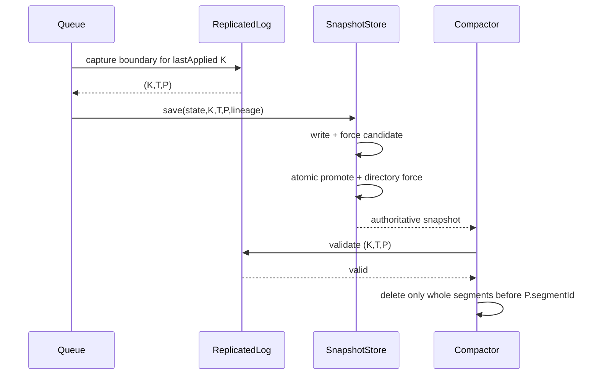

# v0.28 Low-Level Design — Durable Logical Replicated Log

## Status and notation

Accepted and implemented. Names may be refined without changing the recorded
invariants.

```text
K = snapshot.lastIncludedIndex
T = snapshot.lastIncludedTerm
P = snapshot.walPosition
D = localDurableIndex
C = commitIndex
A = lastApplied (runtime)
L = lastLogIndex
```

Required ordering after successful recovery:

```text
0 <= K <= A <= C <= D == L
```

Before majority commit exists, local queue mode may set `C = D` under an
explicit local commit policy. It must never expose that as distributed quorum
durability.

## Domain types

### `LogEntry`

```java
public record LogEntry(
        long logIndex,
        long logTerm,
        WalRecord record
) {}
```

Validation:

- `logIndex > 0`;
- `logTerm > 0` for all new v0.28 entries;
- `record != null`;
- equality covers index, term, and complete record content.

Index zero and term zero are sentinels for “before the first entry”; they are
never encoded as an entry.

### `LogPoint`

```java
public record LogPoint(long logIndex, long logTerm) {}
```

Used by snapshot metadata and previous-entry validation. `(0, 0)` represents
the empty prefix. No other pair containing zero is valid.

Snapshot metadata stores its logical boundary as a `LogPoint`:

```text
snapshot.lastIncludedIndex = K
snapshot.lastIncludedTerm  = termAt(K)
```

The term is the immutable term encoded in entry K when that entry was appended.
It must not be recalculated from `currentTerm`, the most recent retained entry,
or the term active when the snapshot is created.

Example:

```text
entry:             (index=80, term=4)
later currentTerm: 9
snapshot boundary: (lastIncludedIndex=80, lastIncludedTerm=4)
```

Even if the snapshot is created during term 9, it describes state through the
historical entry `(80,4)`. Snapshot creation time and entry origin term are
independent facts.

Boundary lookup follows this order:

1. If K is retained, read and verify the term encoded in entry K.
2. If K was reclaimed, use the term carried by the current authoritative
   snapshot.
3. If neither source can prove `termAt(K)`, fail closed.

When processing a replication request whose `previousLogIndex == K`, compare
`previousLogTerm` with `lastIncludedTerm`. This permits log matching at the
compacted boundary without restoring the reclaimed frame.

### `ReplicaHardState`

```java
public record ReplicaHardState(
        long currentTerm,
        Optional<String> votedFor,
        long commitIndex
) {}
```

Validation:

- `currentTerm >= 0`;
- `commitIndex >= 0`;
- `votedFor` is absent when no vote exists and is bounded when encoded;
- term and commit index are monotonic across accepted updates;
- changing a vote within the same term is rejected;
- `commitIndex <= localDurableIndex` before publication.

## Storage-facing interfaces

The existing `MessageQueue` interface remains unchanged. The logical storage
contract is separate from physical WAL positioning:

```java
interface ReplicatedLog extends AutoCloseable {
    AppendBatchResult appendLocal(long term, List<WalRecord> records);

    AppendBatchResult appendReplicated(
            LogPoint previous,
            List<LogEntry> entries
    );

    List<LogEntry> readFrom(long firstIndex, int maximumEntries);
    Optional<LogEntry> entry(long index);
    LogPoint lastLogPoint();
    long localDurableIndex();
    WalPosition currentDurablePosition();
    StorageLineage lineage();
}
```

`appendLocal` assigns consecutive indexes while holding the per-log append
lock. Index assignment therefore occurs during the authoritative local append,
not in the producer or HTTP layer.

`appendReplicated` receives leader-assigned entries. It validates the previous
point, retry prefix, continuity, and terms before writing new suffix entries.
Automatic truncation is not allowed in v0.28.

### v0.27-to-v0.28 internal contract transition

| v0.27 concept | v0.28 concept | Reason |
|---|---|---|
| `ReplicatedWalEntry.sequence` | `LogEntry.logIndex` | Make identity durable and consensus-ready |
| request `leaderEpoch` | request and entry `logTerm` | Bind every entry to originating authority |
| `records.size()` progress | `lastLogPoint()` | Survive reclaimed prefixes |
| `replica-leader-epoch.bin` | `replica-hard-state.bin` | Keep term, vote, and commit authority together |
| `List<WalRecord>` source read | `List<LogEntry>` logical read | Preserve index and term over transport |
| first sequence only | previous index/term plus entries | Prepare safe prefix validation |

These are internal protocol/storage changes. `MessageQueue` and the public
publish/receive/ACK/NACK HTTP shapes do not change.

### Append result

```java
record AppendBatchResult(
        long firstIndex,
        long durableThroughIndex,
        int appendedEntries,
        int alreadyPresentEntries,
        WalPosition durablePosition
) {}
```

An empty local batch is rejected. A replicated request that is entirely an
identical retry returns a successful result without writing or forcing.

## Append validation algorithm

Validation occurs before any frame is written:

1. Validate open and non-poisoned state.
2. Validate batch entry/byte limits.
3. Validate lineage at the containing request boundary.
4. Validate authority term against durable hard state.
5. Validate `previous`:
   - `(0,0)` only matches before index one or the snapshot boundary rules;
   - retained entry term must match when present;
   - snapshot `(K,T)` supplies the term when the entry itself was reclaimed.
6. Walk supplied entries in order:
   - indexes must be consecutive;
   - existing identical entries count as retries;
   - an existing different term or record is a conflict;
   - new entries must begin exactly at `L + 1` after the retry prefix.
7. Encode every new frame and calculate total bytes.
8. Rotate before the group if it would exceed the segment target.
9. Write all frames in order to one active segment.
10. Call `force(true)` exactly once.
11. Only after force succeeds, publish index entries and advance `D`.

The target size is a rotation threshold, not a hard maximum. A valid batch
larger than the target occupies one oversize segment so a durability group does
not cross segment authority transitions.

## Retry examples

Given durable entries `1..10`:

| Request | Outcome |
|---|---|
| identical `8..10` | success, three already present, no force |
| identical `8..10` plus new `11..12` | validate retry prefix, append 11–12, one force |
| different content at 9 | conflict, no mutation |
| starts at 12 | gap, expected 11, no mutation |
| correct indexes but wrong previous term | conflict, no mutation |

## WAL version 3

### Segment header

The existing magic remains `DQWL`. The header version becomes 3. The lineage
layout remains unchanged:

```text
+----------------------+-------+
| magic "DQWL"         | 4     |
| format version = 3   | 4     |
| queue UUID           | 16    |
| generation UUID      | 16    |
| partition ID         | 4     |
+----------------------+-------+
```

Changing the segment version prevents a v0.28 reader from interpreting v0.27
record-only frames as indexed entries. No migration reader is implemented.

### Entry frame

All integer fields use Java `ByteBuffer` default big-endian order.

```text
+----------------------+-----------------------------+
| payload length       | int32                       |
+----------------------+-----------------------------+
| log index            | int64                       |
| log term             | int64                       |
| record length        | int32                       |
| serialized WalRecord | recordLength bytes          |
+----------------------+-----------------------------+
| CRC32C               | int32 over complete payload |
+----------------------+-----------------------------+
```

The existing logical `WalRecord` serialization may remain delimiter/Base64
encoded initially. The checksum covers index and term as well as record bytes,
so corruption cannot silently reassign content to another logical point.

Frame validation rejects:

- non-positive or oversized payload length;
- non-positive index or term;
- invalid record length;
- record bytes not consuming exactly the declared payload;
- checksum mismatch;
- non-consecutive index relative to the preceding frame or snapshot boundary.

## Batch write failure matrix

| Point of failure | In-process action | Restart interpretation |
|---|---|---|
| Before first write | Poison on I/O failure | Previous durable suffix remains |
| Inside first/middle frame | Poison | Torn active tail removed |
| Between complete frames | Poison | Complete prefix may remain |
| During final frame | Poison | Complete prefix plus torn tail |
| During `force` | Poison; no success | Scan complete frames; durability was ambiguous |
| After successful force | Advance D and return success | Entire group is durable |
| Response lost | No local change | Exact retry proves existing entries |

Only the active segment may tolerate/truncate a torn final frame. A torn or
corrupt sealed segment remains fatal.

## Logical index reconstruction

v0.28 builds an in-memory sparse index during WAL scan:

```text
logIndex -> (segmentId, frameOffset, logTerm)
```

The first implementation may index every retained entry for simplicity. If
memory becomes material, a later measured optimization can retain every Nth
position and scan forward. The on-disk frames remain authoritative.

Startup validates:

- segment IDs are consecutive among retained segments;
- all segment lineages match;
- entry indexes are consecutive across segment boundaries;
- first retained entry is `K + 1` when a mandatory snapshot exists;
- otherwise complete WAL history begins at index one;
- `D` equals the last complete entry index or `K` when no suffix exists.

### Bounded read

`readFrom(firstIndex, maximumEntries)`:

- requires `firstIndex > 0` and a configured positive bound;
- returns at most `maximumEntries` consecutive entries;
- returns empty only when `firstIndex == L + 1`;
- throws `HistoryReclaimedException(K)` when `firstIndex <= K`;
- throws `LogGapException` when `firstIndex > L + 1`;
- never silently begins at a later retained index.

## Hard-state format version 1

File name: `replica-hard-state.bin`.

```text
+----------------------+------------------------------+
| magic "DQHS"         | int32                        |
| version = 1          | int32                        |
| storage lineage      | UUID + UUID + int32          |
| current term         | int64                        |
| vote present         | byte                         |
| votedFor length      | int32                        |
| votedFor UTF-8       | bounded bytes, or none       |
| commit index         | int64                        |
| CRC32C               | int32 over preceding bytes   |
+----------------------+------------------------------+
```

Publication protocol:

1. Serialize and checksum a complete candidate.
2. Write `replica-hard-state.bin.tmp`.
3. Force the candidate.
4. Atomically replace the authority file.
5. Force the parent directory.
6. Update in-memory state only after all steps succeed.

The old `replica-leader-epoch.bin` is replaced, not read or migrated. Any v0.27
directory is already rejected by WAL version 3.

### Term and log ordering

When a follower observes a higher request term, it first publishes hard state
with the higher `currentTerm` and no vote, then validates/appends entries. A
crash may therefore leave a higher term with no entry from that term; this is
safe and continues to fence the previous leader. An entry from a lower term is
rejected before log mutation.

Commit advancement uses the opposite dependency: entries through the proposed
commit index must already be forced before hard state may publish that index.
Thus hard state may lag the log but can never lead it.

```text
higher term acceptance:
    persist term -> append entries

commit advancement:
    force entries -> persist commitIndex
```

## Partition storage layout

```text
<partition-root>/
    wal/
        segment-000000.wal
        segment-000001.wal
    snapshot.bin
    replica-hard-state.bin
```

Candidate files use the existing `.tmp` authority convention and are ignored
or removed during recovery. All three authoritative artifact families carry
the same `StorageLineage`.

## Snapshot version 3

The snapshot header retains magic `DQSN` and changes version to 3. Its payload
adds these fields adjacent to lineage and physical position:

```text
lastIncludedIndex
lastIncludedTerm
```

Validity rules:

- `(K,T) == (0,0)` only for an empty-state snapshot, if empty snapshots remain
  supported;
- otherwise both are positive;
- snapshot state equals application of entries through K;
- `lastIncludedTerm` equals the term originally encoded in entry K, not the
  replica's current term or the snapshot-creation term;
- P is the first byte after entry K;
- `termAt(K) == T` when K remains locally readable;
- K may be older than the first retained entry only after this same snapshot
  authorized reclamation;
- a new snapshot cannot move K or P backwards;
- snapshot lineage must equal WAL and hard-state lineage.

### Snapshot capture ordering

Under the queue mutation lock:

1. Capture the materialized state.
2. Read `lastApplied` as K.
3. Resolve T from the log/snapshot boundary.
4. Capture the corresponding P.
5. Release the mutation lock.
6. Encode, force, promote, and directory-force the snapshot outside the lock
   where existing architecture permits.

The captured tuple is immutable. A later append cannot change what P, K, or T
mean.

## Snapshot and compaction validation



Logical authority prevents replication from requesting reclaimed entries;
physical authority determines which local files are safe to delete.

## Recovery algorithm

1. Discover authoritative `.wal` segments and ignore non-authoritative `.tmp`
   candidates according to existing rules.
2. Read the first header, require WAL version 3, and establish lineage.
3. Validate all segment headers and the segment chain.
4. Decode frames; reject sealed corruption and truncate only a torn active tail.
5. Load snapshot version 3 when present and validate lineage.
6. If retained history does not begin at index one, require a valid snapshot.
7. Validate snapshot `(K,T,P)` against retained frames and boundaries.
8. Rebuild the logical index and determine `(L,lastLogTerm,D)`.
9. Load hard state; reject wrong lineage, checksum, term regression, or `C > D`.
10. Restore snapshot queue state and set runtime `A = K`.
11. Replay entries `K+1..C` for replicated committed recovery. Local compatibility
    mode may replay through D under its explicit local commit policy.
12. Expose the partition only after all validations complete.

## Concurrency and locking

- One append lock per lineage serializes validation, index assignment, rotation,
  write, force, and publication of D.
- Reads may use an immutable/published index snapshot or the same lock initially;
  correctness precedes read optimization.
- Snapshot capture uses the existing queue mutation lock and obtains a stable log
  boundary without waiting on network activity.
- Hard-state publication has its own lock, but any commit update must validate
  against D under a defined lock order: append/log lock before hard-state lock.
- No node-global lock may be held during file force.

Required lock order:

```text
queue mutation/admission
    -> replicated log append
        -> hard state (only when required)
```

Implementation tests must prove no reverse acquisition path exists.

## Package plan

```text
io.github.indreshgahoi.queue.storage.replication
    LogEntry
    LogPoint
    ReplicatedLog
    AppendBatchResult
    ReplicaHardState
    ReplicaHardStateStore
    FileReplicaHardStateStore

io.github.indreshgahoi.queue.storage.wal
    SegmentedFileWriteAheadLog
    WalHeaderCodec
    WalFrameCodec
    physical segment helpers

io.github.indreshgahoi.queue.storage.snapshot
    QueueSnapshot
    FileQueueSnapshotStore

io.github.indreshgahoi.queue.storage.compaction
    existing snapshot-authorized coordination
```

The implementation should not create `consensus`, `raft`, or election packages
in v0.28 because those protocols are not yet implemented.

## Test design

### Format and recovery

- round-trip index, term, and every `WalRecordType`;
- reject v2 segment and v2 snapshot with explicit messages;
- reject checksum mutation of index, term, or record;
- reject logical gaps within and across segments;
- rebuild index after restart and after reclaimed prefix;
- reject snapshot logical/physical disagreement.

### Batch durability

- one batch invokes frame writes in order and one force;
- exact full retry performs no write/force;
- retry-prefix plus new suffix forces only the suffix group;
- validation failure causes no mutation and does not poison;
- write/force failure poisons the instance;
- restart recovers every complete prefix possibility;
- torn final frame is removed only from active segment;
- oversize valid batch remains within one segment.

### Hard state

- round-trip empty and voted state;
- term and commit monotonicity;
- reject two votes in one term;
- candidate failure preserves prior authority;
- promotion/directory-force ambiguity fails closed;
- reject `commitIndex > localDurableIndex` on update and recovery.

### Snapshot and compaction

- snapshot binds K, T, and P atomically;
- snapshot plus suffix reconstructs L after deletion of segment zero;
- stale snapshot cannot replace newer K/P;
- wrong term cannot authorize reclamation;
- missing required snapshot fails closed;
- `lastApplied` recovery begins at K, never from an independent marker.

### Compatibility and regression

- all `MessageQueue` API behavior remains unchanged;
- ACK/NACK/lease/retry/DLQ and capacity recovery tests remain unchanged;
- follower batch bounds and ambiguous retry remain unchanged;
- full `mvn clean test` passes;
- v0.27.1 benchmark cases rerun against production batch append.

## Observability requirements

Structured logs and metrics must distinguish:

- lineage, term, first/last index, entries, bytes, and force duration;
- appended versus already-present entries;
- history-reclaimed, gap, conflict, stale-term, corruption, and poisoned failures;
- recovered torn-tail bytes and recovered durable index;
- snapshot K/T/P and reclaimed segment range.

Message payloads, receipt handles, and full serialized records must never be
logged.

## Implementation review checklist

- Does any sequence still depend on `records.size()` or retained prefix count?
- Can any successful response precede the batch force?
- Can a failed batch writer continue without restart?
- Can one batch cross a segment promotion?
- Can snapshot K/T describe different history from P?
- Can hard state claim a commit beyond durable log history?
- Can standalone local commit be mistaken for majority commit?
- Do old format files fail explicitly rather than parse accidentally?
- Are benchmarks measuring production code rather than only the prototype?
