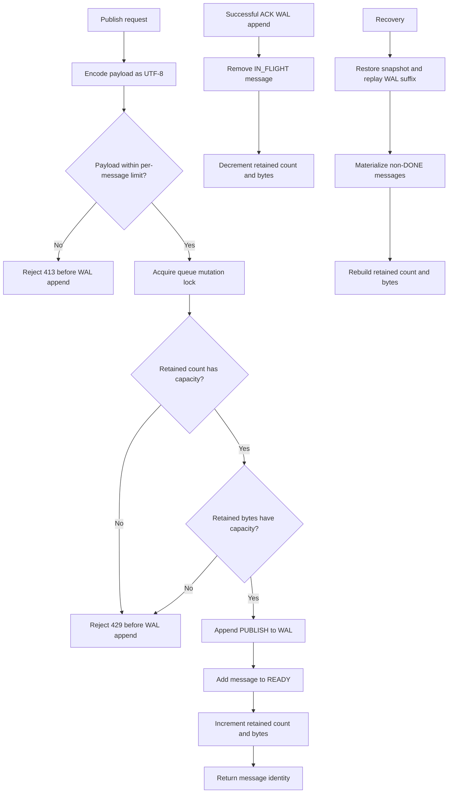

# Bounded Admission Lifecycle

The admission check and corresponding state increment share the queue mutation
lock. A concurrent publish therefore observes either the capacity before the
first publish or the capacity after it; both cannot consume the same remaining
slot.
