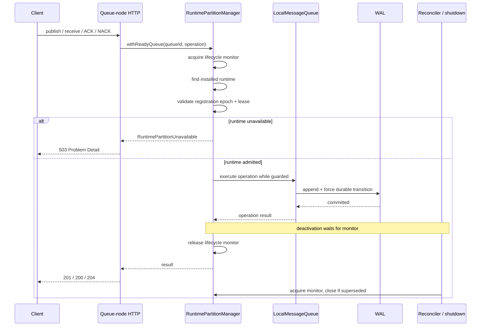
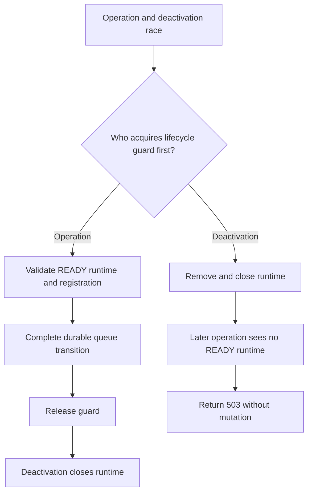

# Data-Plane Operation Lifecycle

> This diagram records the v0.22 node-wide lifecycle guard. ADR 0022 replaces
> that lock scope in v0.23; see the
> [per-partition runtime lifecycle](per-partition-runtime-lifecycle.md).

The runtime manager is both the READY registry and the local lifecycle guard.
Controllers never receive a queue reference that can outlive the guard.

## Race ordering

