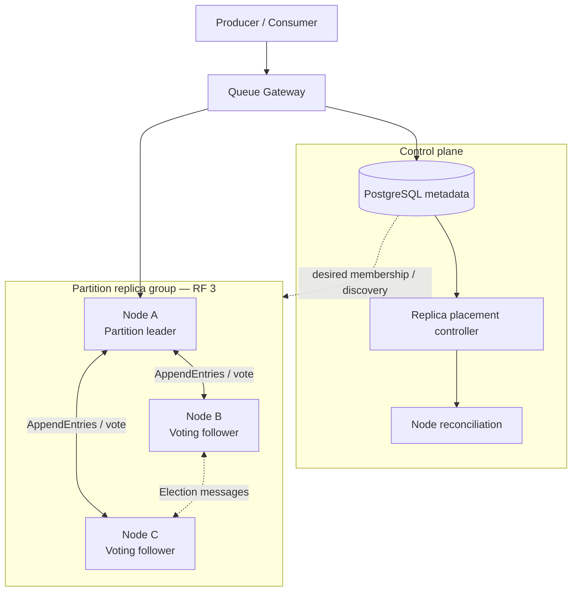
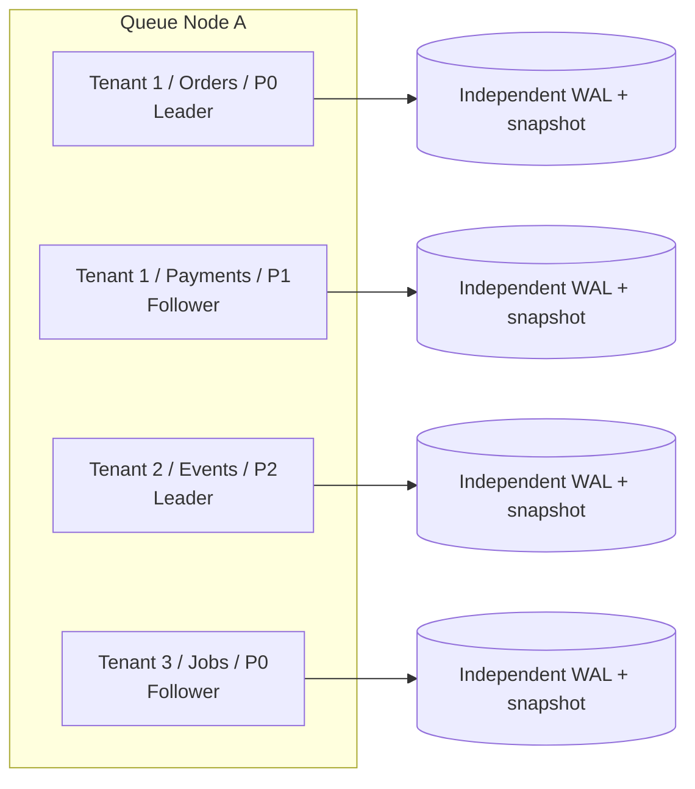
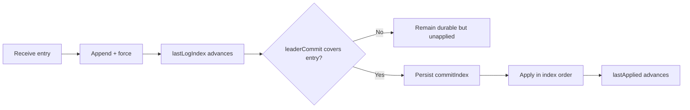
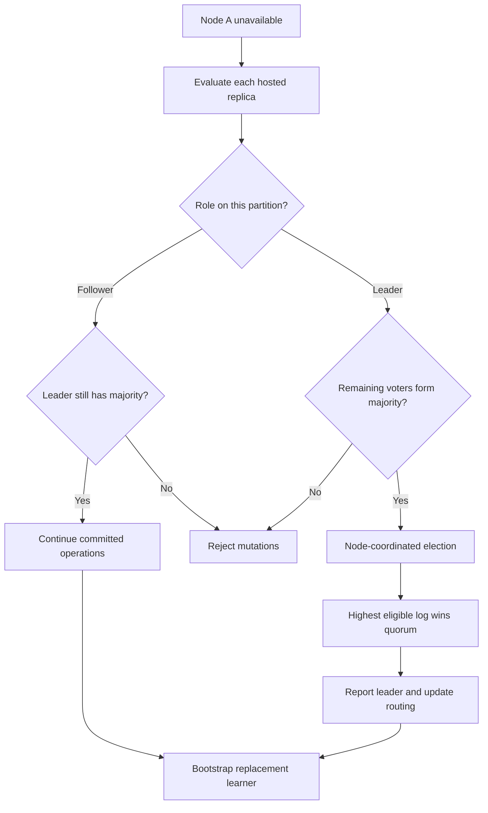

# Distributed Queue Target Architecture

## System topology



PostgreSQL describes desired topology and reports observations. The replica
group owns election, log ordering, and majority commit.

## One node hosting many tenant partitions



Each partition replica has an independent runtime, lifecycle gate, durable log,
snapshot, role, term, and progress. Node failure is decomposed into independent
partition elections or follower replacements.

## Replica state progression



Invariant:

```text
lastApplied <= commitIndex <= lastLogIndex
```

## Node failure recovery


