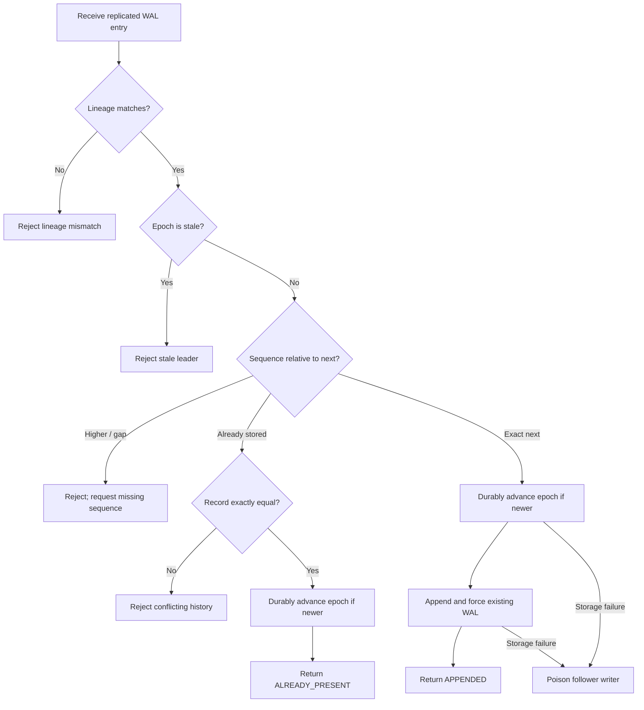

# Follower WAL Append Flow

The epoch fence deliberately becomes durable before the record. If a crash
occurs between those steps, the restarted follower still rejects the obsolete
leader and the current leader can retry the unchanged next sequence.
