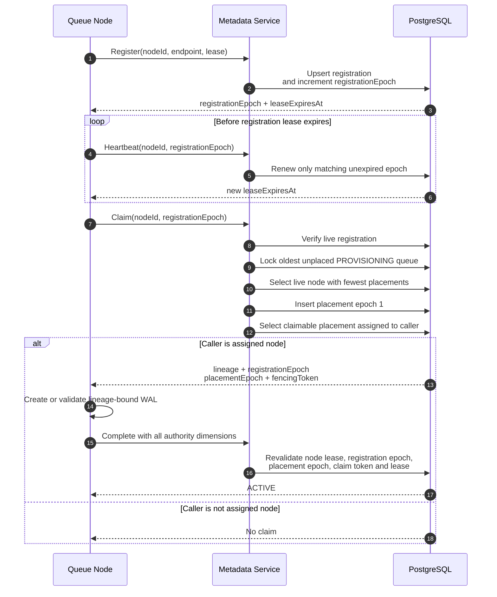

# Node Registration and Placement Flow



The authority dimensions solve different stale-actor problems:

```text
generationId       fences delete and recreate
registrationEpoch  fences old processes using the same nodeId
placementEpoch     fences old partition assignments
fencingToken       fences old provisioning attempts
metadataVersion    fences stale metadata updates
```

