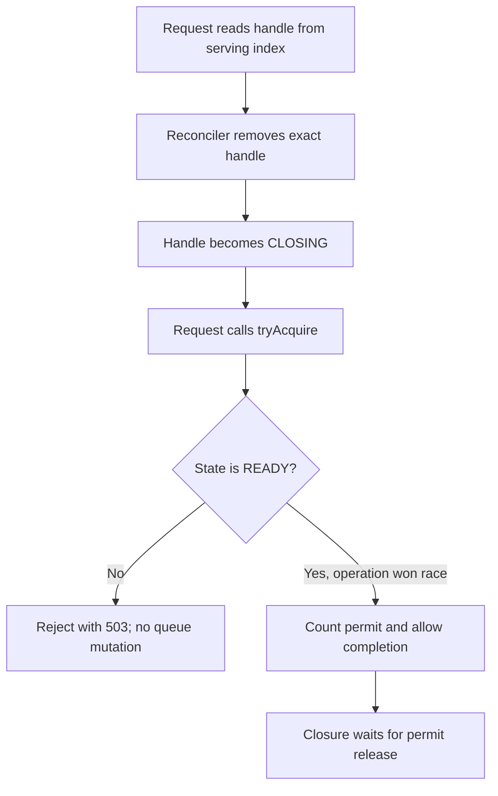

# Per-Partition Runtime Lifecycle

Each active partition owns an admission gate. The queue-ID index is concurrent;
the manager's lifecycle monitor is not held during data-plane storage work.

```mermaid
stateDiagram-v2
    [*] --> READY: recovered and fenced READY
    READY --> READY: acquire/release operation permit
    READY --> CLOSING: authority lost or shutdown
    CLOSING --> CLOSING: drain admitted permits
    CLOSING --> CLOSED: active operations = 0; close queue
    CLOSED --> [*]

    note right of READY
        New permits allowed
        Handle lock held only for accounting
    end note
    note right of CLOSING
        New permits rejected
        Existing operations may finish
    end note
```



## Data-plane operation concurrent with unrelated closure

```mermaid
sequenceDiagram
    participant A as Request for queue A
    participant HA as Handle A
    participant QA as Queue A / WAL
    participant X as Reconciler
    participant HB as Handle B
    participant QB as Queue B / WAL

    A->>HA: tryAcquire()
    HA-->>A: permit; active A = 1
    A->>QA: publish
    Note over QA: slow WAL force

    X->>HA: remove index entry; beginClosing()
    Note over X,HA: wait for active A = 0

    par Queue B remains independent
        X-->>HB: no lifecycle change
        HB->>HB: tryAcquire; active B = 1
        HB->>QB: receive / publish / ACK / NACK
        QB-->>HB: result
        HB->>HB: release; active B = 0
    and Queue A finishes
        QA-->>A: durable result
        A->>HA: release; active A = 0
        HA-->>X: drain complete
        X->>QA: close
    end
```

## Stale lookup race



The handle-local state check closes the gap that a concurrent map removal alone
cannot close: a request may hold a Java reference obtained just before removal.
