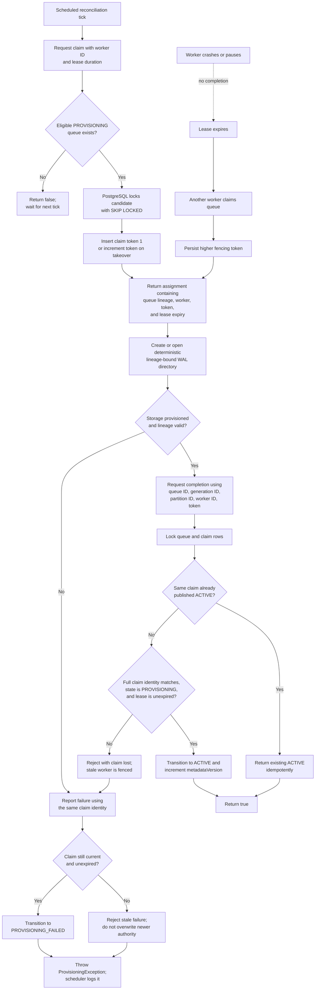

# Provisioning Claim Decision Flow

This flow describes one `ProvisioningReconciler.runOnce()` invocation and how
the durable claim rules control its outcome.



## Authority carried by a claim

A completion request must reproduce the entire persisted identity:

```text
(queueId, generationId, partitionId, workerId, fencingToken)
```

The lease answers *when another worker may take over*. The fencing token
answers *which worker result may still be published*. The storage lineage
prevents retry or takeover from opening storage that belongs to another queue
generation or partition.
