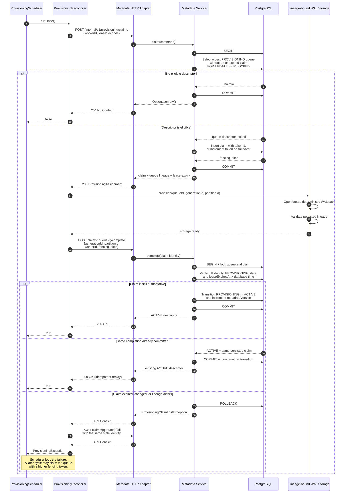

# Provisioning Claim Sequence

This sequence shows the successful path and the important ambiguous-response
path. PostgreSQL is the durable authority for the claim; the fencing token is
checked again when completion is published.

The WAL creation and metadata transition are intentionally not one atomic
transaction. Safety comes from deterministic, lineage-validated storage and a
fenced publication step; progress comes from lease expiry and retry.
