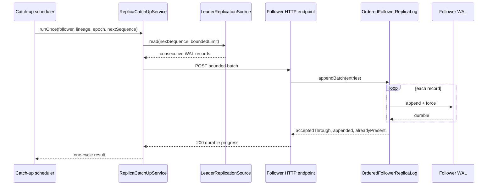

# Replica Catch-Up Sequence

If the HTTP response is lost, the scheduler may retry the same batch. The
follower recognizes its durable prefix or complete batch and does not append
those records again.
