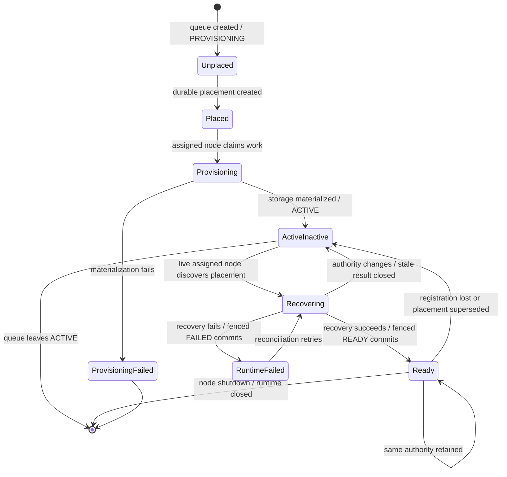
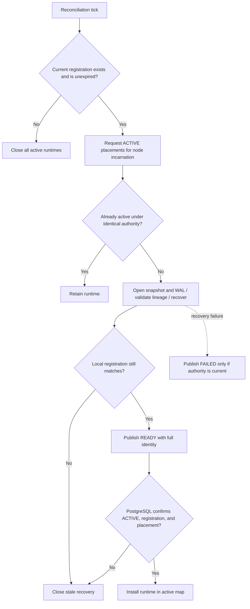

# Runtime Partition Lifecycle

The durable queue lifecycle and node-local runtime lifecycle are related but
not identical. `ACTIVE` makes a partition eligible for recovery; only a fenced
`READY` publication makes the recovered instance observable as ready.

## Reconciliation decision flow

The active map is downstream of PostgreSQL's final validation so a slow
recovery result cannot become usable after its authority was superseded.
