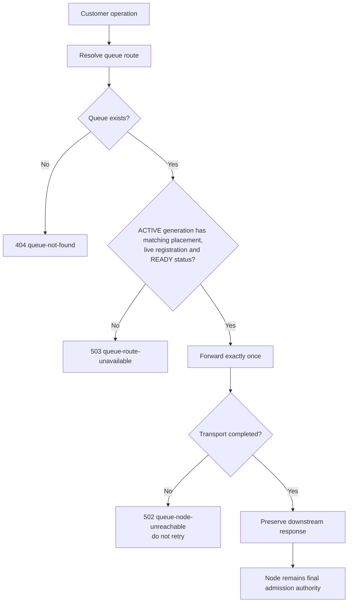

# Stable Routing Decision Flow

```mermaid
flowchart TD
    A[Customer operation] --> B[Resolve queue route]
    B --> C{Queue exists?}
    C -- No --> D[404 queue-not-found]
    C -- Yes --> E{ACTIVE generation has matching placement,<br/>live registration and READY status?}
    E -- No --> F[503 queue-route-unavailable]
    E -- Yes --> G[Forward exactly once]
    G --> H{Transport completed?}
    H -- No --> I[502 queue-node-unreachable<br/>do not retry]
    H -- Yes --> J[Preserve downstream response]
    J --> K[Node remains final admission authority]
```
