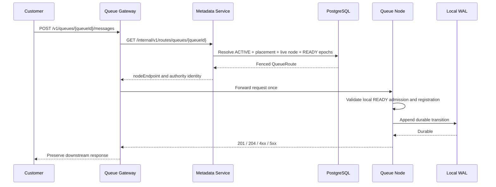

# Stable Data-Plane Routing Sequence

If the node call fails after it may have reached the WAL, the gateway returns
an ambiguous `502 Bad Gateway`. It does not resolve another route or replay the
mutation. The customer must decide whether and how to retry under the queue's
documented at-least-once semantics.
