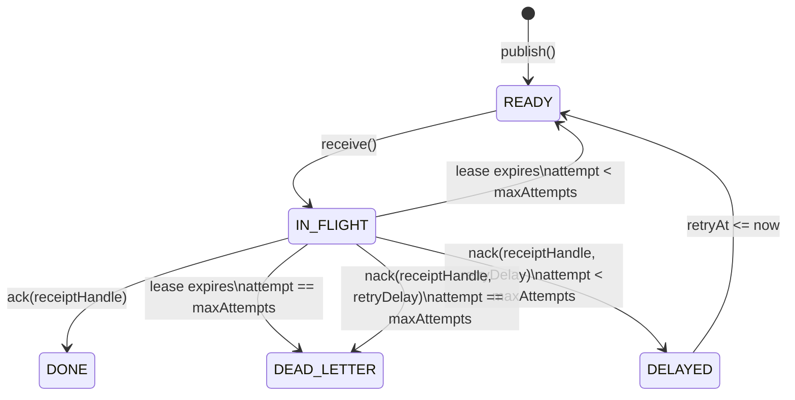

# Queue Semantics

## Version 0.1

### Scope

A single-process, in-memory FIFO queue.

### Guarantees

G1. Every successful message get a unique ID.

G2. Messages are received in publication order.

G3. receive() removes the head message from the queue.

G4. receive() on empty queue returns no messages.

G5. v0.1 is a single threaded and in-memory only.

### Explicit Non-Guarantees

v0.1 provides no guarantee for:

- durability
- acknowledgement
- redelivery
- retries
- concurrent access
- consumer failure recovery
- process failure recovery
- distributed execution

## Known Failure
If a consumer receives a message and crashes before
processing it, the message is lost.
```text
Consumer receive M1 -> M1 is removed -> Consumer crashes -> M1 is permanently lost
```

             


This limitation will motivate acknowledgement semantics
in a later version.

## Version 0.2 — Explicit acknowledgement

### New guarantees

G6. `receive()` does not permanently delete a message.

G7. A received message moves from READY to IN_FLIGHT.

G8. An IN_FLIGHT message is not available for another receive.

G9. `ack()` permanently removes an IN_FLIGHT message.

```text
             receive
READY --------------------> IN_FLIGHT
                                |
                                | ack
                                v
                              DONE
```

## Version 0.3 — Finite leases and redelivery

### Scope

Version 0.3 extends acknowledgement semantics with a finite lease.
The lease represents temporary ownership of a received message and
prevents an unacknowledged message from remaining IN_FLIGHT forever.

### New Guarantees

G10. Every successful `receive()` gives the message a finite lease.

G11. A message remains unavailable to other `receive()` calls while
its lease is valid.

G12. A successful `ack()` made before the lease expires permanently
removes the message.

G13. If the lease expires before a successful acknowledgement, the
message becomes READY and may be delivered again.

G14. A redelivered message retains its original message ID and payload.

G15. A message is IN_FLIGHT under at most one valid lease at a time.

```text
                         receive
                 +--------------------+
                 |                    v
              READY                IN_FLIGHT
                 ^                    |
                 |                    | ack before expiry
                 | lease expires      v
                 +------------------ DONE
```

### Acknowledgement After Lease Expiry

If a message's lease has expired and the message has not been
redelivered, `ack(messageId)` does not remove it.

Acknowledgement in v0.3 identifies a message, not a particular
delivery attempt. After the message is redelivered, a delayed
acknowledgement from its previous consumer is indistinguishable from
an acknowledgement by its current consumer. Preventing this race
would require a unique receipt or lease token for each delivery and
is outside the scope of v0.3.

### Delivery and Ordering Semantics

Version 0.3 provides **at-least-once delivery** with respect to
consumer failure: a message that is received but not acknowledged
before its lease expires becomes available again. Consequently, a
message may be delivered more than once and consumers must tolerate
duplicate processing.

FIFO ordering applies to messages on their first delivery. Redelivery
after lease expiry may change the observable order, so strict FIFO
ordering is not guaranteed across redeliveries.

### Explicit Non-Guarantees

Version 0.3 provides no guarantee for:

- exactly-once delivery or processing
- fencing acknowledgements from expired delivery attempts
- strict FIFO ordering across redeliveries
- lease renewal or extension
- retries with backoff or a maximum attempt count
- dead-letter handling
- concurrent access
- durability or process failure recovery
- distributed execution or clock coordination

## Version 0.4 — recipient handles/ delivery identity
This phase exists because v0.3 ack(messageId) is now incorrect under lease.

### Motivation
The failure is 
```text
T0 C1 receives M1
T1 C1 stalls before ack
T2 M1 lease expires
T3 M1 return to ready state
T4 C2 receives M1
T5 C1 wakes up
T6 C1 calls ack(M1)
```
The issue with the above flow is that C1 acknowledges a delivery that C1 now longer owns.
The violated invariant is :  
> Only the owner of the current active delivery may acknowledge that delivery.
So now we separate the message identity from the delivery identity.
> messageIdentity != deliveryIdentity

### New Guarantees

G16. Every successful 'receive()' creates a unique receipt handle.

G17. Receipt handles identify a delivery attempt, not messages.

G18. Redelivery preserves the message id but creates a new receipt handle.

G19. ack(receiptHandle) succeeds only for the current active recept handle.

G20: An expired receipt handle becomes permanently invalid.

## Version v0.5 — delivery attempts, bounded retries, and poison-message handling.
This version exists because v 0.4 does not provide a way to handle messages that are repeatedly redelivered and never acknowledged.

### Motivation
Consider the following flow:
```text
M1 delivered -> consumer fails -> lease expires -> M1 redelivered -> consumer fails -> lease expires -> M1 redelivered -> ...
```
Without a bound, one poison message can retry forever.
so the invariant would be
> A message may be retried, but retry must be bounded by policy.

### New Guarantees

G21. Every delivery exposes a 1-based attempt number.

G22. Redelivery increments the attempt number by one.

G23. Message ID remains stable across attempts.

G24. Receipt handle changes for every delivery attempt.

G25. A message may be delivered at most maxDeliveryAttempts times.

G26. If the final permitted attempt expires without ACK,
the message moves to DEAD_LETTER.

G27. DEAD_LETTER messages are not eligible for normal receive().
```text
                 publish
                    |
                    v
                +-------+
                | READY |
                +-------+
                    |
                    | receive()
                    v
              +-----------+
              | IN_FLIGHT |
              +-----------+
                |       |
        ack()   |       | lease expires
                |       |
                v       v
             +------+   attempts remaining?
             | DONE |        |
             +------+        +---- yes ----> READY
                              |
                              +---- no -----> DEAD_LETTER
                              
READY(attempt=1)
      |
      | receive()
      v
IN_FLIGHT(attempt=1)
      |
      | lease expires
      v
READY(attempt=2)
      |
      | receive()
      v
IN_FLIGHT(attempt=2)
      |
      | lease expires
      v
READY(attempt=3)
      |
      | receive()
      v
IN_FLIGHT(attempt=3)
      |
      +---------------- ack() ----------------> DONE
      |
      +-------- lease expires ---------------> DEAD_LETTER

IN_FLIGHT
   |
   +-- valid receiptHandle + ack() --> DONE
   |
   +-- lease expires
           |
           +-- attempt < maxDeliveryAttempts --> READY
           |
           +-- attempt == maxDeliveryAttempts --> DEAD_LETTER
```

## Version v0.6 — explicit NACK + retry delay/backoff
Right now, a consumer failure is represented ony by not ACKing and waiting for lease expiry. That works, but it is very 
inefficient when consumer already knows processing failed.
The new requirement is :
> A consumer should be able to explicitly reject the current delivery and request retry without waiting for visibility
> lease to expire.

### New Guarantees
G28. A consumer may explicitly reject its current delivery using nack().

G29. nack() succeeds only for the currently active receipt handle.

G30. A successful nack() immediately invalidates that receipt handle.

G31. If delivery attempts remain, nack() moves the message from IN_FLIGHT
to DELAYED.

G32. A DELAYED message is not eligible for receive() before retryAt.

G33. A DELAYED message becomes READY when now >= retryAt.

G34. Redelivery after nack() preserves the message ID and creates a new
receipt handle.

G35. Redelivery after nack() increments the delivery attempt by one.

G36. If nack() is called on the final permitted delivery attempt, the
message moves directly to DEAD_LETTER.

G37. An expired or stale receipt handle cannot nack a newer delivery.

G38. ACK and NACK are mutually exclusive for a delivery: once either
succeeds, the receipt handle is permanently invalid.

G39. Delayed messages are appended to the tail of READY when their retry
delay expires; strict global FIFO ordering is therefore not guaranteed.

G40. v0.6 does not automatically process delayed messages in a background
thread. Time-based transitions occur only when the explicit delayed
message recovery operation is invoked.

## Version v0.7 — concurrency correctness
### Motivation
> A message must never be owned by two consumers at the same time.  
For example:
```text
Consumer C1                Consumer C2

poll READY M1
                            poll READY M1 ?
```
The implementation must make this transition atomic.
```text
READY -> IN_FLIGHT
```
Notes on Reentrant lock:
ReentrantLock provides exclusive ownership of a critical section. Internally it uses AQS, which maintains synchronization state and 
queues contending threads. In the uncontended path, acquisition can succeed through an atomic state transition. 
Under contention, threads may be queued and parked until the lock becomes available. 
It's reentrant because the owning thread can acquire the same lock multiple times, with a hold count tracking nested acquisitions. 
Unlock decrements that count, and the lock becomes available when it reaches zero. It also establishes the required happens-before relationship 
for memory visibility.

### New Guarantees
G41. Queue operations are safe for concurrent invocation.

G42. A READY message can transition to IN_FLIGHT exactly once
for a given delivery attempt.

G43. No two active receipt handles may represent the same
delivery attempt.

G44. ACK and NACK on the same active delivery cannot both succeed.

G45. Lease-expiry processing cannot race with ACK/NACK in a way
that creates duplicate READY entries.

G45. Delayed-message promotion cannot move the same delayed
message to READY more than once.

The lock protects queue state transitions spanning READY,
IN_FLIGHT, DELAYED, DONE and DEAD_LETTER.

This design intentionally prioritizes correctness and simple
reasoning over maximum parallelism.

Fine-grained locking is deferred until measurement demonstrates
that lock contention is a meaningful bottleneck.

## Version v0.8 -- durability with append only WAL.
This is a major phase shift. Until now, the queue is correct only while the process is alive. if the JVM crashes, 
every READY, IN_FLIGHT, DELAYED, DONE and DEAD_LETTER message disappears.
The new requirement is:
> Successfully accepted queue state must survive restart.
What must hold.
> A state transition must not be reported successful until the corresponding durable record has been written according to the queue's durability contract.

### New Guarantees
G46. A successfully published message survives queue restart.

G47. Queue recovery reconstructs state by replaying the WAL.

G48. WAL append occurs before the corresponding in-memory
state transition is exposed as successful.

G49. An acknowledged message must not reappear after successful
recovery.

G50. Recovery preserves the stable message identity.

G51. v0.8 durability applies to a single queue process and a
single local WAL file only.

No guarantee for v0.8
No replication
No WAL compaction
No snapshotting
No cross-machine durability
No concurrent multi-process access to one WAL
No filesystem corruption recovery guarantee yet