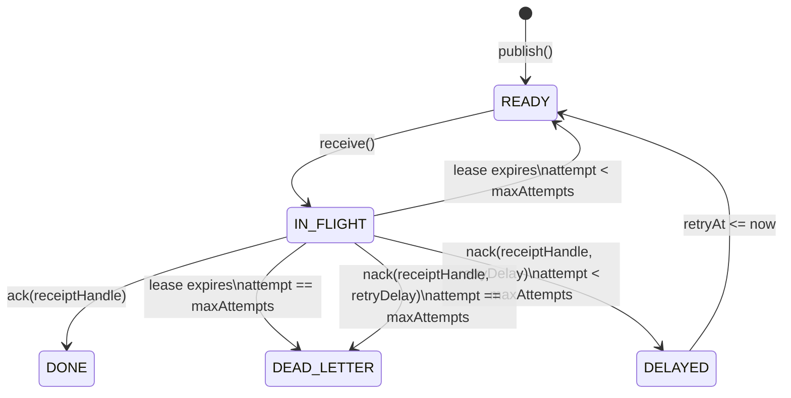

# Queue Semantics

## Version 0.1

### Scope

A single-process, in-memory FIFO queue.

### Guarantees

G1. Every successful message get a unique ID.

G2. Messages are received in publication order.

G3. receive() removes the head message from the queue.

G4. receive() on empty queue returns no messages.

G5. v0.1 is a single threaded and in-memory only.

### Explicit Non-Guarantees

v0.1 provides no guarantee for:

- durability
- acknowledgement
- redelivery
- retries
- concurrent access
- consumer failure recovery
- process failure recovery
- distributed execution

## Known Failure
If a consumer receives a message and crashes before
processing it, the message is lost.
```text
Consumer receive M1 -> M1 is removed -> Consumer crashes -> M1 is permanently lost
```

             


This limitation will motivate acknowledgement semantics
in a later version.

## Version 0.2 — Explicit acknowledgement

### New guarantees

G6. `receive()` does not permanently delete a message.

G7. A received message moves from READY to IN_FLIGHT.

G8. An IN_FLIGHT message is not available for another receive.

G9. `ack()` permanently removes an IN_FLIGHT message.

```text
             receive
READY --------------------> IN_FLIGHT
                                |
                                | ack
                                v
                              DONE
```

## Version 0.3 — Finite leases and redelivery

### Scope

Version 0.3 extends acknowledgement semantics with a finite lease.
The lease represents temporary ownership of a received message and
prevents an unacknowledged message from remaining IN_FLIGHT forever.

### New Guarantees

G10. Every successful `receive()` gives the message a finite lease.

G11. A message remains unavailable to other `receive()` calls while
its lease is valid.

G12. A successful `ack()` made before the lease expires permanently
removes the message.

G13. If the lease expires before a successful acknowledgement, the
message becomes READY and may be delivered again.

G14. A redelivered message retains its original message ID and payload.

G15. A message is IN_FLIGHT under at most one valid lease at a time.

```text
                         receive
                 +--------------------+
                 |                    v
              READY                IN_FLIGHT
                 ^                    |
                 |                    | ack before expiry
                 | lease expires      v
                 +------------------ DONE
```

### Acknowledgement After Lease Expiry

If a message's lease has expired and the message has not been
redelivered, `ack(messageId)` does not remove it.

Acknowledgement in v0.3 identifies a message, not a particular
delivery attempt. After the message is redelivered, a delayed
acknowledgement from its previous consumer is indistinguishable from
an acknowledgement by its current consumer. Preventing this race
would require a unique receipt or lease token for each delivery and
is outside the scope of v0.3.

### Delivery and Ordering Semantics

Version 0.3 provides **at-least-once delivery** with respect to
consumer failure: a message that is received but not acknowledged
before its lease expires becomes available again. Consequently, a
message may be delivered more than once and consumers must tolerate
duplicate processing.

FIFO ordering applies to messages on their first delivery. Redelivery
after lease expiry may change the observable order, so strict FIFO
ordering is not guaranteed across redeliveries.

### Explicit Non-Guarantees

Version 0.3 provides no guarantee for:

- exactly-once delivery or processing
- fencing acknowledgements from expired delivery attempts
- strict FIFO ordering across redeliveries
- lease renewal or extension
- retries with backoff or a maximum attempt count
- dead-letter handling
- concurrent access
- durability or process failure recovery
- distributed execution or clock coordination

## Version 0.4 — recipient handles/ delivery identity
This phase exists because v0.3 ack(messageId) is now incorrect under lease.

### Motivation
The failure is 
```text
T0 C1 receives M1
T1 C1 stalls before ack
T2 M1 lease expires
T3 M1 return to ready state
T4 C2 receives M1
T5 C1 wakes up
T6 C1 calls ack(M1)
```
The issue with the above flow is that C1 acknowledges a delivery that C1 now longer owns.
The violated invariant is :  
> Only the owner of the current active delivery may acknowledge that delivery.
So now we separate the message identity from the delivery identity.
> messageIdentity != deliveryIdentity

### New Guarantees

G16. Every successful 'receive()' creates a unique receipt handle.

G17. Receipt handles identify a delivery attempt, not messages.

G18. Redelivery preserves the message id but creates a new receipt handle.

G19. ack(receiptHandle) succeeds only for the current active recept handle.

G20: An expired receipt handle becomes permanently invalid.

## Version v0.5 — delivery attempts, bounded retries, and poison-message handling.
This version exists because v 0.4 does not provide a way to handle messages that are repeatedly redelivered and never acknowledged.

### Motivation
Consider the following flow:
```text
M1 delivered -> consumer fails -> lease expires -> M1 redelivered -> consumer fails -> lease expires -> M1 redelivered -> ...
```
Without a bound, one poison message can retry forever.
so the invariant would be
> A message may be retried, but retry must be bounded by policy.

### New Guarantees

G21. Every delivery exposes a 1-based attempt number.

G22. Redelivery increments the attempt number by one.

G23. Message ID remains stable across attempts.

G24. Receipt handle changes for every delivery attempt.

G25. A message may be delivered at most maxDeliveryAttempts times.

G26. If the final permitted attempt expires without ACK,
the message moves to DEAD_LETTER.

G27. DEAD_LETTER messages are not eligible for normal receive().
```text
                 publish
                    |
                    v
                +-------+
                | READY |
                +-------+
                    |
                    | receive()
                    v
              +-----------+
              | IN_FLIGHT |
              +-----------+
                |       |
        ack()   |       | lease expires
                |       |
                v       v
             +------+   attempts remaining?
             | DONE |        |
             +------+        +---- yes ----> READY
                              |
                              +---- no -----> DEAD_LETTER
                              
READY(attempt=1)
      |
      | receive()
      v
IN_FLIGHT(attempt=1)
      |
      | lease expires
      v
READY(attempt=2)
      |
      | receive()
      v
IN_FLIGHT(attempt=2)
      |
      | lease expires
      v
READY(attempt=3)
      |
      | receive()
      v
IN_FLIGHT(attempt=3)
      |
      +---------------- ack() ----------------> DONE
      |
      +-------- lease expires ---------------> DEAD_LETTER

IN_FLIGHT
   |
   +-- valid receiptHandle + ack() --> DONE
   |
   +-- lease expires
           |
           +-- attempt < maxDeliveryAttempts --> READY
           |
           +-- attempt == maxDeliveryAttempts --> DEAD_LETTER
```

## Version v0.6 — explicit NACK + retry delay/backoff
Right now, a consumer failure is represented ony by not ACKing and waiting for lease expiry. That works, but it is very 
inefficient when consumer already knows processing failed.
The new requirement is :
> A consumer should be able to explicitly reject the current delivery and request retry without waiting for visibility
> lease to expire.

### New Guarantees
G28. A consumer may explicitly reject its current delivery using nack().

G29. nack() succeeds only for the currently active receipt handle.

G30. A successful nack() immediately invalidates that receipt handle.

G31. If delivery attempts remain, nack() moves the message from IN_FLIGHT
to DELAYED.

G32. A DELAYED message is not eligible for receive() before retryAt.

G33. A DELAYED message becomes READY when now >= retryAt.

G34. Redelivery after nack() preserves the message ID and creates a new
receipt handle.

G35. Redelivery after nack() increments the delivery attempt by one.

G36. If nack() is called on the final permitted delivery attempt, the
message moves directly to DEAD_LETTER.

G37. An expired or stale receipt handle cannot nack a newer delivery.

G38. ACK and NACK are mutually exclusive for a delivery: once either
succeeds, the receipt handle is permanently invalid.

G39. Delayed messages are appended to the tail of READY when their retry
delay expires; strict global FIFO ordering is therefore not guaranteed.

G40. v0.6 does not automatically process delayed messages in a background
thread. Time-based transitions occur only when the explicit delayed
message recovery operation is invoked.

## Version v0.7 — concurrency correctness
### Motivation
> A message must never be owned by two consumers at the same time.  
For example:
```text
Consumer C1                Consumer C2

poll READY M1
                            poll READY M1 ?
```
The implementation must make this transition atomic.
```text
READY -> IN_FLIGHT
```
Notes on Reentrant lock:
ReentrantLock provides exclusive ownership of a critical section. Internally it uses AQS, which maintains synchronization state and 
queues contending threads. In the uncontended path, acquisition can succeed through an atomic state transition. 
Under contention, threads may be queued and parked until the lock becomes available. 
It's reentrant because the owning thread can acquire the same lock multiple times, with a hold count tracking nested acquisitions. 
Unlock decrements that count, and the lock becomes available when it reaches zero. It also establishes the required happens-before relationship 
for memory visibility.

### New Guarantees
G41. Queue operations are safe for concurrent invocation.

G42. A READY message can transition to IN_FLIGHT exactly once
for a given delivery attempt.

G43. No two active receipt handles may represent the same
delivery attempt.

G44. ACK and NACK on the same active delivery cannot both succeed.

G45. Lease-expiry processing cannot race with ACK/NACK in a way
that creates duplicate READY entries.

G45. Delayed-message promotion cannot move the same delayed
message to READY more than once.

The lock protects queue state transitions spanning READY,
IN_FLIGHT, DELAYED, DONE and DEAD_LETTER.

This design intentionally prioritizes correctness and simple
reasoning over maximum parallelism.

Fine-grained locking is deferred until measurement demonstrates
that lock contention is a meaningful bottleneck.

## Version v0.8 -- durability with append only WAL.
This is a major phase shift. Until now, the queue is correct only while the process is alive. if the JVM crashes, 
every READY, IN_FLIGHT, DELAYED, DONE and DEAD_LETTER message disappears.
The new requirement is:
> Successfully accepted queue state must survive restart.
What must hold.
> A state transition must not be reported successful until the corresponding durable record has been written according to the queue's durability contract.

### New Guarantees
G46. A successfully published message survives queue restart.

G47. Queue recovery reconstructs state by replaying the WAL.

G48. WAL append occurs before the corresponding in-memory
state transition is exposed as successful.

G49. An acknowledged message must not reappear after successful
recovery.

G50. Recovery preserves the stable message identity.

G51. v0.8 durability applies to a single queue process and a
single local WAL file only.

No guarantee for v0.8
No replication
No WAL compaction
No snapshotting
No cross-machine durability
No concurrent multi-process access to one WAL
No filesystem corruption recovery guarantee yet
## Version v 0.8.2
G52. A successfully acknowledged message must not
reappear after restart.

G53. ACK is considered successful only after its WAL
record has been durably appended.

G54. Recovery applies ACK records to the logical message
identified by messageId.

G55. Receipt handles are runtime delivery ownership tokens
and are not restored as active ownership after restart.

PUBLISH M1
↓
receive M1
↓
ACK M1
↓
JVM crashes
↓
restart
↓
WAL only contains PUBLISH M1
↓
M1 comes back

That violates:
An acknowledged message must not reappear after recovery.

## Version 0.8.3 — Durable NACK and Delayed Retry Recovery

### Scope

Version 0.8.3 extends WAL durability to explicit negative acknowledgement.

A successful `nack()` must preserve the message's delayed-retry state across
process restart.

This version still uses:

- a single local WAL
- one queue process
- explicit delayed-message promotion
- no background retry scheduler
- no replication

---

## New Guarantees

G56 — Successful NACK Is Durable
G57 — Delayed State Survives Restart
G58 — Retry Schedule Survives Restart
G59 — Retry Attempt Survives Restart
G60 — Message Identity Survives NACK Recovery
G61 — Old Receipt Handle Is Not Restored, After success nack()
G62 — NACK WAL Failure Is Atomic
G63 — Final-Attempt NACK Does Not Enter DELAYED

A successful `nack()` must be recorded in the WAL before the corresponding
in-memory transition is considered successful.

The transition is:

```text
IN_FLIGHT
    |
    | nack(retryDelay)
    v
DELAYED
```
If the WAL append fails, the message must remain IN_FLIGHT.

v0.8.3 does not yet guarantee:
- durable lease-expiry transitions
- durable dead-letter transitions unless separately implemented
- background delayed-message promotion
- replication
- multi-process WAL sharing
- WAL compaction
- snapshots
- corruption recovery

## Version 0.8.4 — Durable Lease Expiry

### G61 — Successful Lease Expiry Transition Is Durable

When an expired IN_FLIGHT delivery is requeued, the transition must be
persisted before the in-memory state is changed.

Required ordering:

IN_FLIGHT
|
| lease expires
v

append LEASE_EXPIRED to WAL
|
v

remove IN_FLIGHT
|
v

READY(nextAttempt)


### G64 — Delivery Attempt Survives Restart

If attempt N expires and is successfully requeued, recovery must reconstruct
the message with:

nextAttempt = N + 1

Restart must not reset the message to attempt 1.


### G65 — Expired Receipt Handle Is Invalid

Once lease expiry has successfully transitioned the message, the old receipt
handle no longer owns the message.

ACK or NACK using that receipt handle must fail.


### G66 — WAL Failure Does Not Expire Ownership

If the LEASE_EXPIRED WAL append fails, the queue must not partially apply the
transition.

The message remains IN_FLIGHT with its existing receipt handle.


### G67 — Recovery Produces One Logical Message State

Repeated lease expiries, NACKs, ACKs and publishes must fold into one final
logical state per message.

Recovery must not create duplicate READY or DELAYED representations.

## Version v0.9 — WAL Crash Safety & Corruption Recovery

### Motivation
So far we've assumed:
> wal.append(record)  either completely succeeds or completely fails.
Real storge does not give us such a clean world.

Consider:
```text
WAL currently:
[PUBLISH M1]
[PUBLISH M2]

Writing:
[PUBLISH M3........
                  ↑
               CRASH
```
After restart the file might contain:
```text
valid record
valid record
partial record
```
Now our readAll() now has to answer much harder questions:
> How do I distinguish a valid record from a partial record?

this is where project start moving from "queue implementation" toward storage-engine thinking.

v0.9 goals
```text
v0.9.1  Framed WAL records
        ↓
v0.9.2/9.3  Detect truncated tail
        ↓
v0.10  Checksum / corruption detection
        ↓
v0.9.4  Recovery policy
```

**v0.9.1 — WAL record framing**
Suppose your current encoding is effectively:
```text
PUBLISH|M1|payload|...
PUBLISH|M2|payload|...
```
That's easy to inspect, but recovery needs reliable record boundaries.
Instead introduce a frame:
┌──────────────┬───────────────────────┐
│ length       │ encoded WAL record    │
│ 4 bytes      │ N bytes               │
└──────────────┴───────────────────────┘
For example:
```text
[length=37][PUBLISH M1 ...]
[length=42][NACK M2 ...]
[length=31][ACK M3 ...]
```

Now recovery can reason:
read 4-byte length
↓
length = 42
↓
are 42 bytes available?
│
yes ──→ decode record
│
no ──→ truncated tail

## Version 0.9.1 — Framed WAL Records

### G68 — WAL Records Have Explicit Boundaries

Every WAL record is stored as an independently framed entry.

A frame consists of:

    [record-length][record-payload]

The record length describes the number of bytes belonging to the
encoded WAL record.

Recovery must use the frame boundary rather than relying on delimiter
scanning or end-of-line parsing.

### G69 — Recovery Never Reads Across Record Boundaries

A WAL decoder must consume exactly the number of bytes declared by the
record frame.

Bytes belonging to a subsequent record must never be interpreted as
part of the current record.

### G70 — Incomplete Frames Are Detectable

If the WAL contains a complete length prefix but fewer payload bytes
than declared, recovery must recognize the record as incomplete rather
than decoding it as a valid WAL record.

## Version v0.9.2 — torn-tail recovery policy.
Now we have framing, which lets us detect:
```text
[M1 complete]
[M2 complete]
[M3 partial]
```
The next question is:
> When the last WAL is incomplete because of crash, should startup fail completely or should we recover the valid prefix and discard the torn tail?

For this project:
> Recover all complete frames, ignore/truncate only an incomplete final frame, but fail on corruption in the middle of the WAL.

That give us clear distinction:
```text
truncated tail after crash
→ recoverable

corruption in committed history
→ fail loudly
```
### G71. Recovery may discard an incomplete final WAL frame.

### G72. All complete frames before the incomplete tail remain valid.

### G73. Recovery must never silently skip corruption between valid records.

### G74. After successful tail recovery, the WAL must be truncated to the last complete frame boundary before accepting new writes.

## Version v0.10 — WAL Integrity with CRC32C
We solved the structural integrity with framing:
```text
[length][payload]
```
This detects torn write.
But there is still failure you can't detect.
Suppose the complete record is.
```text
[length = 100][100 payload bytes]
```
one byte is corrupted
```text
Before:
[length=100][... A B C D E ...]

After:
[length=100][... A X C D E ...]
                  ↑
               corruption
```
From framing perspective everything looks perfect:
```text
length = 100 ✓
100 bytes available ✓
```
Depending on which byte changed. deserialization may even succeed. 
That's dangerous because we could recover **incorrect state without knowing it**.
so we are introducing:
```text
┌────────────┬─────────────┬──────────────┐
│ Length     │ Payload     │ Checksum     │
│ 4 bytes    │ N bytes     │ 4 bytes      │
└────────────┴─────────────┴──────────────┘
```
The write path becomes:
```text
WalRecord
   ↓
serialize
   ↓
payload bytes
   ↓
CRC32C(payload)
   ↓
[length][payload][checksum]
   ↓
writeFully
   ↓
force
```
Recovery:
```text
read length
    ↓
read N payload bytes
    ↓
read checksum
    ↓
calculate CRC32C(payload)
    ↓
       match?
      /      \
    yes       no
     ↓         ↓
deserialize   CORRUPTION
              fail recovery
```
## v0.10.0 — WAL Record Integrity

### G73 — Every complete WAL frame carries an integrity checksum

Each WAL frame contains:

    [payload-length][payload][CRC32C]

The checksum is calculated from the payload bytes.

### G74 — Recovery verifies integrity before deserialization

Recovery MUST verify the stored CRC32C against the checksum calculated
from the recovered payload before interpreting the payload as a WalRecord.

### G75 — Checksum mismatch is corruption

A structurally complete frame whose checksum does not match its payload
is treated as WAL corruption.

Recovery MUST fail with WalException.

### G76 — Corruption must not be silently repaired

A checksum mismatch MUST NOT be treated as a torn final frame.

Recovery MUST NOT silently truncate a complete frame solely because its
checksum is invalid.

### G77 — Torn-tail recovery remains supported

An incomplete final frame remains recoverable using the existing
torn-tail policy.

Complete valid frames before the torn tail are preserved.

### Version v0.11.0 — WAL format versioning.
Now we have a real reason for it because our physical wal format has already evolved. 
```text
v0.8
delimiter-based records

v0.9
[length][payload]

v0.10
[length][payload][CRC32C]
```
**Motivation**
Right now if an older file is open by newer code, recovery has no explicit way to know which format it is reading.

> The new requirement is
> Recovery must be able to identify the WAL format before interpreting the records.
we would introduce small fixed WAL header 
```text
+-------------+-------------+
| Magic       | Version     |
| 4 bytes     | 4 bytes     |
+-------------+-------------+
```
Conceptually:
```text
WAL file

[magic = DQWL]
[version = 1]

[length][payload][checksum]
[length][payload][checksum]
...
```
The magic answers:
> "is this even one of our WAL files?"

The version answers:
> "Which decoder and recovery rules should I use?"

G78. Every WAL starts with a fixed magic identifier.

G79. Every WAL declares its physical format version.

G80. Recovery must validate the WAL header before reading records.

G81. Unknown WAL versions must fail explicitly rather than being
interpreted using the current decoder.

G82. Opening an existing WAL must not rewrite or duplicate its header.

## Version v0.12.1 — Snapshot foundation.
This is the right next problem our WAL is now durable, framed, crash-safe, checksummed, and versioned -- 
**but it grows forever**

current recovery model:
```text
PUBLISH M1
ACK M1
PUBLISH M2
NACK M2
LEASE_EXPIRED M2
...
millions of records
        ↓
restart
        ↓
replay entire WAL from byte 0
```
Even if only 100 messages are currently live, recovery may need to process millions of historical transitions.  

The new problem is:
> Durable history grows with all past operations, while recovery only needs the current logical state plus history after some safe point.  
v0.12 mental model **introduce snapshot**

```text
WAL history:

R1 R2 R3 R4 ... R1,000,000
                    |
                    v
                 SNAPSHOT

Snapshot contains current state:
READY
DELAYED
DEAD_LETTER
attempt metadata
retryAt
```
Then new writes continue:
```text
Snapshot at offset X
        +
WAL records after X
```
Recovery becomes:
```text
load snapshot
      ↓
restore logical state
      ↓
replay WAL records after snapshot position
      ↓
materialize queue
```
Instead of replay entire lifetime history

G83. A snapshot represents a complete logical queue state at a known WAL position.

G84. A snapshot must become durable before WAL history covered by it
can be discarded.

G85. Recovery starts from the newest valid snapshot and replays only
WAL records written after that snapshot.

G86. Creating a snapshot must not change externally visible queue semantics.

G87. If snapshot creation fails, the existing WAL remains sufficient
for recovery.

G88. A corrupt or incomplete snapshot must never cause valid WAL
history to be discarded.

```text
write snapshot
      ↓
force snapshot
      ↓
establish snapshot as valid
==============================
only after this boundary
      ↓
compact old WAL
```

# v0.11.1 — Durable Delivery Lease Start

## Scope

Version 0.11.1 makes delivery ownership durable.

Before this version, `receive()` created the following state only in memory:

- receipt handle
- delivery attempt
- lease expiry time
- IN_FLIGHT ownership

A queue restart could therefore forget that a message had already been delivered.

v0.11.1 persists the delivery lease before exposing the delivery to the consumer.

---

## G83 — Delivery ownership is durable before exposure

`receive()` must persist the delivery lease before returning the delivery to
the consumer.

Required ordering:

    READY
      |
      | choose message
      v
    create receiptHandle
    create leaseUntil
      |
      v
    append LEASE_STARTED to WAL
      |
      v
    durability boundary
      |
      v
    READY -> IN_FLIGHT
      |
      v
    return Delivery

A consumer must never receive a delivery whose ownership exists only in
volatile memory.

---

## G84 — LEASE_STARTED contains sufficient recovery state

The durable lease record must contain at least:

    messageId
    receiptHandle
    attempt
    leaseUntil

These fields are sufficient to reconstruct the active delivery after restart.

The message payload does not need to be repeated because the original
PUBLISH record already contains the canonical message data.

---

## G85 — Queue restart does not terminate an active lease

If a queue process restarts while a delivery lease is still valid, recovery
must restore that delivery as IN_FLIGHT.

Example:

    10:00 receive M1
          receipt = R1
          leaseUntil = 10:30

    10:10 queue crashes

    10:12 queue restarts

Recovered state:

    M1 = IN_FLIGHT
    receiptHandle = R1
    attempt = 1
    leaseUntil = 10:30

M1 must not become READY merely because the queue process restarted.

---

## G86 — Receipt handle survives queue restart

A receipt handle belongs to a delivery lease, not to a specific JVM process.

If the lease remains valid after recovery:

    ack(R1)

and:

    nack(R1, retryDelay)

remain valid operations.

The receipt handle becomes invalid only when the delivery terminates through:

- ACK
- NACK
- lease expiry
- DEAD_LETTER transition
- another explicitly defined terminal ownership transition

---

## G87 — Delivery attempt survives restart

Recovery must preserve the delivery attempt associated with the active lease.

Example:

    M1 attempt = 2
    receipt = R2
    leaseUntil = T

After restart:

    attempt remains 2

A restart must not reset the delivery attempt.

---

## G88 — Lease expiry time survives restart

The absolute `leaseUntil` value must be persisted.

Recovery must not recalculate the lease using:

    restartTime + visibilityTimeout

Example:

    receive at 10:00
    visibilityTimeout = 30 seconds
    leaseUntil = 10:00:30

    restart at 10:00:20

Correct:

    lease still expires at 10:00:30

Incorrect:

    leaseUntil = 10:00:50

Persist the scheduling decision, not merely the input used to produce it.

---

## G89 — Failed LEASE_STARTED persistence leaves message READY

If the `LEASE_STARTED` WAL append fails:

    receive()

must fail without completing the READY -> IN_FLIGHT transition.

The message must remain READY.

No receipt handle may become active.

No Delivery may be returned to the consumer.

Required behavior:

    generate delivery metadata
            |
            v
    append LEASE_STARTED
            |
          failure
            |
            v
    READY remains unchanged

---

## G90 — Recovery reconstructs active IN_FLIGHT ownership

During WAL replay:

    PUBLISH M1
    LEASE_STARTED M1 R1 attempt=1 leaseUntil=T

must fold into:

    M1 -> IN_FLIGHT
    receiptHandle = R1
    attempt = 1
    leaseUntil = T

Subsequent durable transitions may replace that state:

    ACK
        -> DONE

    NACK
        -> DELAYED

    LEASE_EXPIRED
        -> READY

    DEAD_LETTER
        -> DEAD_LETTER

Recovery materializes only the final logical state.

---

## G91 — A message has at most one active delivery lease

Recovery must never construct multiple active receipt handles for the same
logical delivery state.

The WAL fold must produce one authoritative final state per message.

---

## State Model

Normal delivery:

    READY
      |
      | receive()
      | persist LEASE_STARTED
      v
    IN_FLIGHT
      |
      +---- ACK ------------> DONE
      |
      +---- NACK -----------> DELAYED / DEAD_LETTER
      |
      +---- lease expiry ---> READY / DEAD_LETTER


Restart does not cause a transition:

    IN_FLIGHT
       |
       | queue restart
       v
    IN_FLIGHT

The active lease remains authoritative until its normal termination condition.

## VERSION v0.12.1 — Snapshot semantics and state model.
The key principle is:
A snapshot is a durable image of the queue’s logical state at a specific WAL position.

So a snapshot must answer two questions:
1. What is the queue state?
2. Up to which WAL record/offset does this state already include history?
   For your queue, the snapshot should capture the current logical state:
   READY
- message
- nextAttempt

IN_FLIGHT
- message
- receiptHandle
- attempt
- leaseUntil

DELAYED
- message
- nextAttempt
- retryAt

DEAD_LETTER
- message
  DONE messages do not need to be stored because they no longer belong to active queue state.
  The recovery model becomes:
  load latest valid snapshot
  ↓
  restore READY / IN_FLIGHT / DELAYED / DLQ
  ↓
  find snapshot WAL position
  ↓
  replay WAL records AFTER that position
  ↓
  fold to final logical state
  ↓
  apply current-time rules for leases
  ↓
  materialize runtime queue
  That WAL position is critical. Suppose:
  WAL:

R1 PUBLISH M1
R2 LEASE_STARTED M1
R3 PUBLISH M2
R4 ACK M1
R5 PUBLISH M3
If snapshot was taken after R3, it represents:
snapshotWalPosition = R3
Recovery must do:
snapshot
+
replay R4, R5

## v0.12.1 — Snapshot Semantics

### G92 — Snapshot represents complete logical queue state

A snapshot contains all non-terminal queue state required to recover:

- READY
- IN_FLIGHT
- DELAYED
- DEAD_LETTER

DONE messages are omitted.

### G93 — Snapshot is associated with a WAL position

Every snapshot records the WAL position up to which its state is complete.

Recovery must replay only WAL records after that position.

### G94 — Active leases are preserved

IN_FLIGHT snapshot entries preserve:

- message
- receiptHandle
- attempt
- leaseUntil

Queue restart does not invalidate an active lease.

### G95 — Expired leases are derived during recovery

If an IN_FLIGHT lease stored in the snapshot has expired by recovery time:

- move to READY(nextAttempt), or
- DEAD_LETTER if max attempts are exhausted.

Recovery does not write new WAL history for this derived transition.

### G96 — Retry schedule survives snapshot recovery

DELAYED entries preserve the absolute `retryAt`.

Restart must not reset retry delay.

### G97 — Snapshot creation must not change queue semantics

Taking a snapshot must not:

- consume a message;
- invalidate a receipt handle;
- change attempts;
- alter ordering;
- change retry times.

### G98 — Failed snapshot creation cannot replace the last valid recovery point

The existing WAL and previous valid snapshot must remain sufficient for recovery if creation of a new snapshot fails.


> The next design question is the important one:  
How do we identify the WAL position represented by the snapshot?
```text
There are two reasonable choices for our local WAL:
A. byte offset
B. monotonically increasing WAL sequence number
```
## VERSION v0.12.2 — Snapshot-Based Recovery.
The goal of this phase is:
> Recover queue state from the latest durable snapshot, then replay only the WAL suffix after the snapshot’s WalPosition.
The architecture becomes:
```text
                STARTUP

                   |
                   v

         loadLatestSnapshot()
                   |
          +--------+--------+
          |                 |
      snapshot             none
          |                 |
          v                 v
   restore snapshot     empty state
          |                 |
          +--------+--------+
                   |
                   v
          determine WAL position
                   |
                   v
          readFrom(WalPosition)
                   |
                   v
            replay WAL suffix
                   |
                   v
       resolve time-based state
                   |
                   v
         materialize queue state
```
The critical invariant for this release is:
> Snapshot state plus WAL records after the snapshot position must produce exactly the same logical state as replaying the complete WAL from the beginning.

## v0.12.2 — Snapshot-Based Recovery

### G99 — Recovery may begin from a valid snapshot

If a valid snapshot exists, recovery restores the snapshot state instead of
replaying WAL history already represented by that snapshot.

### G100 — WAL replay begins exactly at the snapshot WalPosition

The snapshot position is:

    WalPosition(segmentId, offset)

The offset represents the first WAL byte NOT included in the snapshot.

Recovery therefore replays records beginning exactly at that position.

### G101 — Snapshot + WAL suffix is equivalent to full WAL replay

For any valid snapshot S taken at WAL position P:

    recover(S, WAL[P..end])

must produce the same logical queue state as:

    recover(empty, WAL[beginning..end])

### G102 — WAL position must be a valid frame boundary

Recovery must reject a snapshot whose WAL offset points:

- before the WAL record area;
- beyond the end of the WAL;
- inside a WAL frame.

A snapshot position is trusted only after validation against the WAL.

### G103 — Snapshot state is restored before WAL suffix replay

Recovery order is:

    restore snapshot
        |
        v
    replay WAL suffix

WAL suffix records may supersede snapshot state.

Examples:

    snapshot: M1 READY
    suffix: LEASE_STARTED M1
    result: M1 IN_FLIGHT

or:

    snapshot: M1 IN_FLIGHT
    suffix: ACK M1
    result: DONE

### G104 — Active snapshot leases preserve ownership

If an IN_FLIGHT entry from the snapshot has:

    leaseUntil > recoveryTime

then recovery restores:

    message
    receiptHandle
    attempt
    leaseUntil

The receipt handle remains valid.

### G105 — Expired snapshot leases are derived during recovery

If:

    leaseUntil <= recoveryTime

the lease is no longer active.

Recovery derives:

    READY(nextAttempt)

or:

    DEAD_LETTER

when max delivery attempts are exhausted.

Recovery does not append a new LEASE_EXPIRED record for this derived state.

### G106 — WAL suffix can supersede snapshot-derived state

The WAL is newer than the snapshot.

Therefore WAL suffix transitions are authoritative over snapshot state.

### G107 — Missing snapshot falls back to full WAL replay

If no snapshot exists:

    recovery begins from the first WAL record.

Snapshot support must not make snapshot existence mandatory.

### G108 — Invalid snapshot must not silently produce partial recovery

If snapshot integrity or WAL-position validation fails, the recovery policy
must explicitly decide whether to:

- fail startup; or
- ignore the snapshot and replay the complete WAL.

This policy must not be accidental.
> If the snapshot itself is corrupt, fall back to full WAL replay only if the WAL is still complete and available.
```text
                    STARTUP
                       |
             +---------+---------+
             |                   |
         snapshot             no snapshot
             |                   |
             v                   v
     RecoveryState map       empty map
             |                   |
             +---------+---------+
                       |
                       v
                WAL records
             suffix / complete
                       |
                       v
                applyWalRecord()
                       |
                       v
              final logical state
                       |
                       v
            materializeRecoveredState()
                       |
            +----------+-----------+
            |          |           |
          READY    IN_FLIGHT    DELAYED/DLQ
```
## v0.12.3 — Crash-Safe Snapshot Replacement

### G109 — Snapshot replacement never destroys the previous recovery point first

A new snapshot must be written to a separate candidate file.

The current valid snapshot must not be truncated or overwritten while the
candidate is being constructed.

### G110 — Candidate snapshot must cross its durability boundary before promotion

Required order:

    write candidate
        |
        v
    force candidate
        |
        v
    promote candidate
        |
        v
    new snapshot becomes authoritative

### G111 — Failed candidate creation preserves the previous snapshot

If writing or forcing the candidate fails:

    previous snapshot remains authoritative
    candidate is discarded or ignored

### G112 — Failed promotion must not be reported as successful replacement

If candidate promotion fails, save() must fail.

The store must not claim that the new snapshot became authoritative.

### G113 — Stray temporary snapshots are not authoritative

A `.tmp` or candidate snapshot left by a failed/crashed save must never
automatically supersede `snapshot.dat`.

### G114 — Successful replacement exposes exactly one authoritative snapshot

After successful save(S2):

    loadLatest() -> S2

The previous S1 must no longer be returned.

### G115 — Snapshot save failure does not affect WAL recoverability

Snapshot creation is currently an optimization.

Until WAL compaction is introduced, failure to replace a snapshot must not
make the queue unrecoverable because the complete WAL remains available.

## v0.12.3 — Crash-Safe Snapshot Replacement

### G109 — Snapshot replacement never destroys the previous recovery point first

A new snapshot must be written to a separate candidate file.

The current valid snapshot must not be truncated or overwritten while the
candidate is being constructed.

### G110 — Candidate snapshot must cross its durability boundary before promotion

Required order:

    write candidate
        |
        v
    force candidate
        |
        v
    promote candidate
        |
        v
    new snapshot becomes authoritative

### G111 — Failed candidate creation preserves the previous snapshot

If writing or forcing the candidate fails:

    previous snapshot remains authoritative
    candidate is discarded or ignored

### G112 — Failed promotion must not be reported as successful replacement

If candidate promotion fails, save() must fail.

The store must not claim that the new snapshot became authoritative.

### G113 — Stray temporary snapshots are not authoritative

A `.tmp` or candidate snapshot left by a failed/crashed save must never
automatically supersede `snapshot.dat`.

### G114 — Successful replacement exposes exactly one authoritative snapshot

After successful save(S2):

    loadLatest() -> S2

The previous S1 must no longer be returned.

### G115 — Snapshot save failure does not affect WAL recoverability

Snapshot creation is currently an optimization.

Until WAL compaction is introduced, failure to replace a snapshot must not
make the queue unrecoverable because the complete WAL remains available.

## v0.12.4 — Safe WAL Compaction / History Reclamation.
### Motivation
In current implementation, WAL grows indefinitely on disk even when the in-memory queue size remain bounded. 
Now that we have snapshot, Disk space must be reclaimed by deleting the WAL suffix.
This is the first phase where mistake can cause the real data loss, so design the rule.
> Delete WAL history only after a newly authoritative snapshot make the history unnecessary for recovery.  
## v0.12.4 — Safe WAL Compaction Boundary

### G116 — Only an authoritative snapshot may define a compaction boundary

Temporary, candidate, incomplete, or failed snapshots must never advance
the compaction point.

Only the snapshot returned by `loadLatest()` may be considered authoritative.

### G117 — Snapshot WalPosition defines the maximum reclaimable history

For an authoritative snapshot:

    WalPosition(segmentId, offset)

all WAL history logically represented by the snapshot is eligible for
future reclamation.

The snapshot position is an exclusive boundary:

    history before P    -> represented by snapshot
    history from P      -> required WAL suffix

### G118 — Compaction must never delete the WAL suffix

Records at or after the snapshot WalPosition are required for recovery and
must remain available.

Recovery invariant:

    snapshot
    +
    WAL suffix from snapshot.walPosition()
    =
    current logical state

### G119 — Snapshot promotion must precede compaction

Required ordering:

    capture snapshot
        |
        v
    persist candidate
        |
        v
    force candidate
        |
        v
    atomic promotion
        |
        v
    snapshot authoritative
        |
        v
    compaction may begin

Compaction must never run against an uncommitted candidate snapshot.

### G120 — Compaction failure must preserve recoverability

Compaction may reclaim less history than intended.

It must never reclaim more history than allowed by the authoritative snapshot.

Partial cleanup is acceptable only when:

    authoritative snapshot
    +
    remaining WAL suffix

still forms a complete recovery path.

### G121 — Compaction boundary is monotonic

A compaction boundary may stay unchanged or advance.

It must never move backward.

Example:

    current = (segment 7, offset 100)

valid:
(7, 100)
(7, 500)
(8, 200)

invalid:
(6, 900)
(7, 50)

### G122 — Current single-segment implementation does not reclaim WAL prefixes

Until WAL segmentation is implemented, v0.12.4 determines safe compaction
boundaries but does not rewrite or remove arbitrary bytes from the active WAL.

### G123 — Recovery correctness takes priority over space reclamation

If there is uncertainty whether history is covered by an authoritative
snapshot, that history must be retained.

Compaction must fail safe toward retaining data.

## Version 0.12.5
```text
Current
-------
queue.wal
   ↓
grows continuously


v0.12.5
-------
wal/
├── segment-000000.wal   SEALED
├── segment-000001.wal   SEALED
├── segment-000002.wal   SEALED
└── segment-000003.wal   ACTIVE
                              ↑
                         new writes
```
Segmentation becomes necessary a single WAL file eventually creates three problems at once:
1. WAL grows without bound.
2. old history is awkward to reclaim
3. operation actions like compaction becomes risky because they modify the same file that is still receiving writes.

Solution: Segmentation  
It changes the storage shape:
```text
wal/
├── segment-000001.wal   SEALED
├── segment-000002.wal   SEALED
├── segment-000003.wal   SEALED
└── segment-000004.wal   ACTIVE
```
Only active segments receive writes. Once it reaches a configured limit, say 64 MB, it sealed and never modified again.
```text
segment 4 ACTIVE
      ↓ reaches threshold
segment 4 SEALED
      ↓
create segment 5
      ↓
segment 5 ACTIVE
```
That give us powerful invariant:
> Sealed segments are immutable durable history; only the active segment changes.  

Now compaction becomes mush simpler, Suppose the authoritative snapshot position is:
```text
WalPosition(
    segmentId = 4,
    offset = 12_480
)
```
Then:
```text
segment 1  → entirely older than snapshot → deletable
segment 2  → entirely older than snapshot → deletable
segment 3  → entirely older than snapshot → deletable
segment 4  → snapshot lies inside it       → KEEP
segment 5  → newer history                 → KEEP
```
We don't have to rewrite the segment 4 just to reclaim some space. Delete whole immutable segments first. 
That is deliberately conservative, but mush safer.

There is another operational benefit: a corrupt or torn write can normally affect only the active tail segment. 
Sealed segments should already have been validated and are immutable.
```text
segment 1 SEALED ✓
segment 2 SEALED ✓
segment 3 SEALED ✓
segment 4 ACTIVE
                 ↑
              crash here
```
That gives us a useful failure boundary.

The next important concept is **rotation**. Imagine segment 4 is almost full:
```text
segment 4:
[frame][frame][frame] ... 63.99 MB
```
A new WAL record arrives that would cross the configured limit. We need to perform:
```text
finish current segment
        ↓
seal segment 4
        ↓
create/initialize segment 5
        ↓
make segment 5 active
        ↓
append new record there
```
> Should rotation happen before appending a record that would exceed the limit, or allow the final record to exceed the nominal segment size and rotate afterward?
I recommend later
segment target = 64 MB

current size = 63.9 MB
next frame   = 500 KB

append entire frame to segment 4
→ segment becomes ~64.4 MB

then rotate before the NEXT append

That gives another invariant:
> A WAL record belongs entirely to exactly one segment.  

The resulting write path becomes: 
```text
append(record)
    ↓
is active segment already >= target?
    ↓ yes
rotate
    ↓
serialize record
    ↓
[length][payload][CRC]
    ↓
append entire frame
    ↓
force
    ↓
return WalPosition
```
Invariants:
1. Exactly one segment is active for append.
2. Sealed segments are never modified.
3. Segment IDs increase monotonically.
4. A frame is never split across segments.
5. Recovery replays segments in segmentId order.
6. Only the final active segment may contain a recoverable torn tail.
7. WalPosition always identifies a boundary inside a specific segment.
8. Rotation must preserve a complete recovery path across crashes.
## v0.12.5 — Segmented WAL

### G124 — Exactly one WAL segment is active

The highest valid segment ID is the active segment.

All lower segment IDs are sealed and immutable.

### G125 — Sealed segments are immutable

Once a newer segment becomes authoritative, previous segments must never
receive additional WAL records.

### G126 — Segment IDs increase monotonically

If segment N is active, the next segment created by rotation is N + 1.

Segment IDs are never reused during normal operation.

### G127 — WAL frames never span segments

A complete WAL frame:

    [length][payload][checksum]

must exist entirely within exactly one segment.

A record must never begin in one segment and finish in another.

### G128 — Segment size is a rotation threshold, not a hard record boundary

A frame may cause the current segment to exceed the configured target size.

Rotation occurs before the next append.

This avoids splitting records across segments.

### G129 — Temporary segments are not authoritative

Files such as:

    segment-000004.tmp

must never participate in normal WAL recovery.

Only successfully promoted `.wal` files are authoritative.

### G130 — A new segment becomes active through one publication event

Rotation creates and initializes a temporary candidate:

    segment-(N+1).tmp

After it is complete and durable, it is atomically promoted to:

    segment-(N+1).wal

The existence of the new valid `.wal` file makes it active by definition.

No separate ACTIVE/SEALED metadata is required.

### G131 — Recovery replays segments in ascending segment ID order

Recovery order:

    segment 0
    segment 1
    segment 2
    ...

Record order within each segment is preserved.

### G132 — Only the highest authoritative segment may contain a recoverable torn tail

A torn tail in the active segment may be recovered using the existing
truncation policy.

A malformed/torn sealed segment is corruption and must not be silently repaired.

### G133 — WalPosition identifies a position inside one specific segment

    WalPosition(segmentId, offset)

is meaningful only within the identified segment.

### G134 — Empty active segment is valid

A newly promoted segment containing only its WAL header is valid and may
become the active segment before any records are appended.

## v0.13.0 — Snapshot-Authorized WAL Segment Reclamation

### Motivation

Segmentation makes old WAL history physically removable, but does not itself
authorize removal. A successfully promoted snapshot is the recovery artifact
that makes an older WAL prefix redundant.

For a snapshot at `WalPosition(S, offset)`, recovery still requires segment S
from `offset` onward. The conservative whole-file rule is therefore:

    segmentId < S  -> reclaimable
    segmentId >= S -> retained

The offset does not change that rule. Segment S is retained even when the
snapshot position is exactly at its end.

### G135 — Only an authoritative snapshot grants deletion authority

A snapshot grants authority only after `QueueSnapshotStore.save(snapshot)`
returns successfully. A failed save cannot advance the compaction boundary or
trigger reclamation.

### G136 — Stale snapshots cannot advance deletion authority

A snapshot older than the current committed boundary is rejected before it can
replace the authoritative snapshot or invoke WAL compaction. Equal positions
remain idempotent.

### G137 — Reclamation is strictly before the snapshot segment

Given snapshot position `(S, offset)`, only segments with IDs strictly less
than S may be deleted. The boundary segment S is always retained, including at
offset zero or the segment's end-of-file.

### G138 — The active segment is never reclaimed

The highest authoritative WAL segment is active. A reclamation request whose
boundary crosses that segment fails before deletion. A boundary equal to the
active segment may remove only lower, sealed segments.

### G139 — Partial deletion failure preserves recovery safety

Segments are deleted independently in ascending ID order. If deletion stops
partway, every deleted file was already strictly before the authoritative
snapshot segment. The remaining prefix may be safely retried; no rollback or
all-or-nothing filesystem transaction is required.

### Responsibility split

    authoritative snapshot promotion
                -> pure planner derives boundary S
                -> reclaimer deletes segmentId < S

The planner performs no I/O. The reclaimer owns filesystem side effects and
active-segment protection. Coordinators only enforce ordering and orchestration.

## v0.14.0 — Compaction-Aware Recovery Authority

### G140 — WAL-only recovery requires complete history

Recovery may fall back to `readAll()` only when the WAL still begins with
segment 0. A segmented WAL whose earliest authoritative segment is greater
than 0 is a retained suffix, not a complete recovery source.

### G141 — A reclaimed WAL prefix makes the snapshot mandatory

If WAL history before the earliest retained segment has been reclaimed, a
missing, unreadable, or invalid authoritative snapshot must fail recovery.
The queue must never start from the retained suffix alone.

### G142 — Recovery proves the snapshot boundary before availability

Snapshot recovery must validate that the snapshot `WalPosition` names an
available WAL segment and a valid frame boundary. Failure is a startup error;
it must not produce a partially recovered queue.

### G143 — Snapshot authority is reconstructed after restart

The latest committed snapshot position initializes the compaction boundary
when a snapshot/compaction coordinator is created. Restart must not erase the
monotonic authority established by an earlier committed snapshot.

### G144 — Candidate position validation precedes snapshot promotion

A candidate snapshot must reference a valid position in the current WAL
before it may replace the authoritative snapshot. Validation failure must
leave both the previous snapshot and compaction boundary unchanged.

### G145 — Complete WAL preserves pre-compaction fallback

When authoritative WAL history still begins at segment 0, a missing or corrupt
snapshot remains an optional optimization failure. Recovery may ignore it and
replay the complete WAL.

## v0.15.0 — Durable Filesystem Authority Transitions

### G146 — File durability and name durability are separate boundaries

For a newly created, promoted, replaced, or deleted durable artifact,
`FileChannel.force(true)` on file contents does not by itself establish the
durability of the containing directory entry.

### G147 — Snapshot promotion succeeds only after directory durability

Required success order:

    write candidate
    -> force candidate file
    -> atomic promotion
    -> force parent directory
    -> report success

Only a save that completes this sequence may authorize WAL reclamation.

### G148 — Post-promotion snapshot failure is indeterminate but safe

If snapshot rename succeeds and parent-directory force fails, `save()` must
report failure. The new name may be visible in the running process, but its
survival across power loss is not guaranteed. Compaction must not be
authorized by that failed attempt.

### G149 — WAL segment publication includes directory durability

Initial segment creation and rotated-segment promotion must force the WAL
directory before the segment publication operation reports success or accepts
records whose durability depends on the new name.

### G150 — Post-promotion WAL failure poisons the writer

If a new `.wal` segment is atomically promoted but directory force fails, the
current WAL instance must reject further appends. Restart re-discovers the
authoritative on-disk segment set and re-establishes directory durability.

### G151 — Segment deletion includes directory durability

After deleting each reclaimable segment, the WAL directory must be forced
before reclamation proceeds to another segment. A directory-force failure
stops reclamation and is safe to retry.

### G152 — Filesystem support is required explicitly

If the platform cannot open and force the parent directory, an authority
transition requiring directory durability fails. The implementation must not
silently downgrade its durability contract.

## v0.16.0 — Automatic Bounded Storage Lifecycle

### G153 — Checkpoint policy depends on durable WAL progress

The initial policy uses WAL segment distance from the latest authoritative
snapshot. Volatile queue depth and process-local transition counters do not
define durable checkpoint progress.

### G154 — Policy and lifecycle mechanism are separate

`CheckpointPolicy` decides whether current WAL progress warrants a new
checkpoint. `StorageLifecycleManager` owns scheduling, snapshot capture,
commit, reclamation retry, failure observation, and shutdown.

### G155 — Maintenance cycles are serialized

Scheduled and explicitly invoked maintenance cycles must never overlap within
one lifecycle manager. At most one snapshot/compaction sequence may execute at
a time.

### G156 — Maintenance failure does not reverse queue operations

Queue transitions already acknowledged through the WAL remain successful when
later background snapshot or reclamation work fails. Maintenance failure is
recorded for observation and retried independently.

### G157 — Snapshot-save failure requires a new capture attempt

If a candidate did not become authoritative, the next eligible cycle captures
queue state again. It must not assume that the failed candidate is committed.

### G158 — Post-commit reclamation failure is retried without new WAL progress

If the candidate is now the authoritative snapshot but reclamation failed,
the next cycle retries compaction from that snapshot even when the checkpoint
policy would not request a newer snapshot.

### G159 — Existing snapshots trigger startup reconciliation

When lifecycle management starts with an existing authoritative snapshot, its
first maintenance cycle retries eligible reclamation. This recovers cleanup
work lost because of an earlier failure or process crash.

### G160 — Scheduled failures do not stop future cycles

A failed scheduled cycle must not cancel fixed-delay execution. The failure is
observable, and later cycles continue so transient storage errors can recover.

### G161 — Lifecycle shutdown is explicit and idempotent

Closing the lifecycle manager stops future scheduling. Further explicit
maintenance calls are rejected, and repeated close calls are safe.

### G162 — Segment-distance policy gives a physical-history bound

With successful periodic maintenance, a threshold of N segments triggers a
checkpoint after the active segment advances N IDs beyond the latest snapshot
segment. The threshold is not a hard byte bound because a complete WAL frame
may exceed the configured segment target.

## v0.17.0 — Durable Storage Lineage

### G163 — Durable artifacts identify one storage lineage

Every file-backed WAL and snapshot carries the tuple
`(queueId, generationId, partitionId)`. The queue ID identifies the logical
queue, the generation ID fences an independently created storage history for
that queue, and the partition ID identifies the future partition boundary.

### G164 — One segmented WAL has one lineage

The first segment establishes the WAL lineage. Every later segment must carry
the same tuple. Startup fails before replay if any authoritative segment has a
different lineage.

### G165 — Reopen preserves identity

Opening existing WAL storage without a configured lineage adopts the persisted
lineage. Opening it with an expected lineage succeeds only when the complete
tuple matches. New empty storage generates a lineage unless one is supplied.

### G166 — Snapshot recovery requires lineage equality

A snapshot may seed recovery only when its lineage exactly matches the WAL
lineage. A mismatch is an authority violation, not snapshot corruption and not
an optional optimization failure; recovery fails even when complete WAL
history is available.

### G167 — Foreign snapshots cannot authorize reclamation

The snapshot compaction coordinator is configured with the WAL lineage. It
must reject a candidate or previously authoritative snapshot with another
lineage before promotion, boundary advancement, or segment deletion.

### G168 — Storage formats advance without migration

The file WAL header is version 2 and includes lineage. The snapshot format is
version 2 and includes lineage in its checksum-protected payload. Earlier
formats are rejected explicitly; this learning-stage release provides no
in-place migration.
